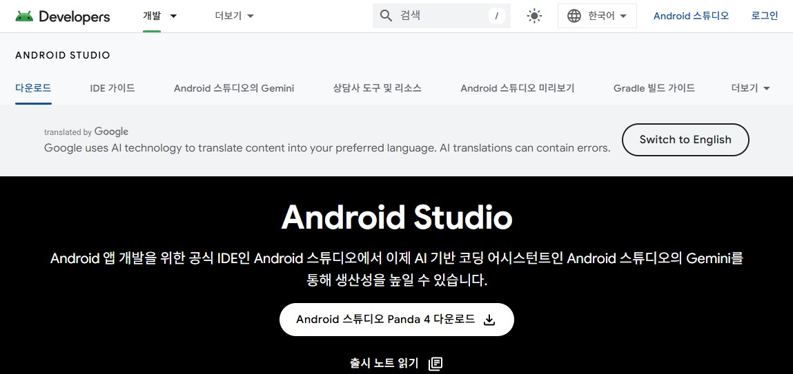

## Android Studio를 설치하자

[안드로이드 스튜디오 설치](https://developer.android.com/studio)(https://developer.android.com/studio)
를 설치를 하자. 

Android Studio는 Android 앱 개발자에게 많은 편의성을 제공한다.
그러면서도 무료이니 매우 좋은 개발 환경이다.

구글과 Jetbrains가 협력해서 만든 통합 개발 환경이다.
심지어 자바와 코틀린 같은 프로그래밍 언어를 사용하는데 필요한
JDK설치도 이 에디터에서 간편하게 설치하고 사용할 수 있다.