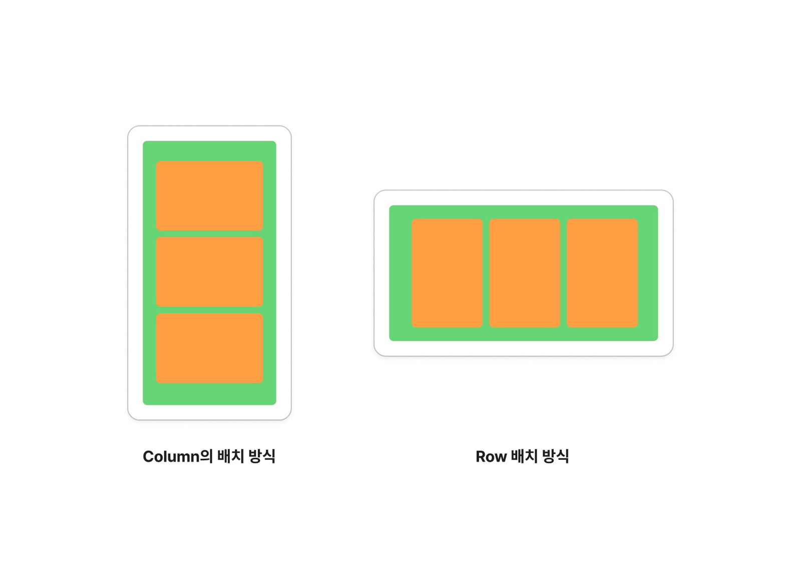
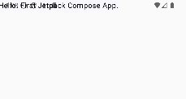
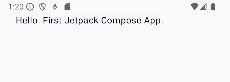
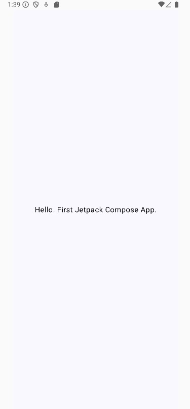
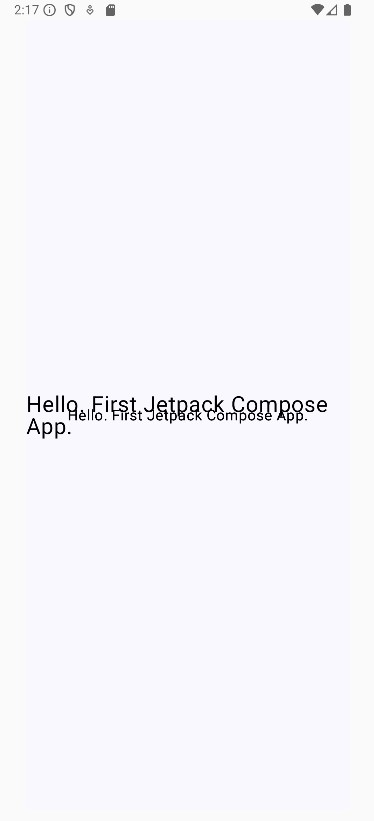
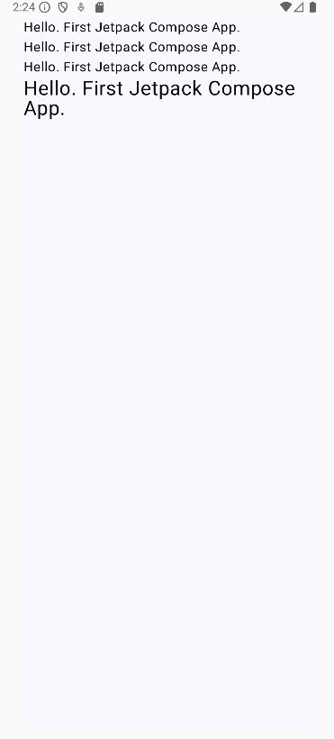

## Jetpack Compose에서 위젯을 어떻게 만드나?

[1. 열과 행으로 빠르게 구성할 수 있다.](#1-열과-행으로-빠르게-구성할-수-있다)  
[2. 박스로 시작하는 화면 구성](#2-박스로-시작하는-화면-구성)  
[3. 여러 위젯을 배치해보자.](#3-여러-위젯을-배치해보자)

* * *

### 1. 열과 행으로 빠르게 구성할 수 있다

Jetpack Compose에서는 많이 사용하는 세 가지 위젯이 있다.

- Box
- Column
- Row

Box는 화면 안에 별다른 제약 없이 자유롭게 배치할 수 있는 위젯이다. 그에 반해 Column과 Row는 자신의 하위 위젯들을 배치할 때 제약을 준다.

Jetpack Compose는 Column이라는 위젯과 Row라는 위젯으로 UI를 빠르게 구성할 수 있다. 여기서 Modifier까지 더해야 하지만 Modifier는 이후에 나올 테니 그때 설명하도록 하고, 그럼 어떻게 빠르게 구성할 수 있느냐? 그 전에 Column과 Row를 어떻게 사용하는지를 살펴보자.


- **초록색 컨테이너** : Column(Row)
- **주황색 박스** : Column(Row)의 하위 위젯

Column은 위에서 아래로 순서대로 배치하고 Row는 왼쪽에서 오른쪽으로 순서대로 배치한다.
위 이미지에서 초록색 박스가 Column 또는 Row이고 주황색 박스는 여러분이 배치할 위젯이다.
저 주황색 박스가 Row가 될 수도 있고 Column이 될 수도 있다! 이러한 중첩 구조를 활용하면 테이블 형태도 만들 수 있다.

이제 코드로 확인해보자.

### 2. 박스로 시작하는 화면 구성

프로젝트를 생성하고 필자는 다음과 같이 작성했다.

```kt
class MainActivity : ComponentActivity() {
    override fun onCreate(savedInstanceState: Bundle?) {
        super.onCreate(savedInstanceState)
        enableEdgeToEdge()
        setContent {
            WikiAppTheme {
                App()
            }
        }
    }
}

@Composable
fun App() {
    Box(
        modifier = Modifier
            .background(MaterialTheme.colorScheme.background)
    ) {
        Text(
            text = "Hello. First Jetpack Compose App.",
        )
    }
}
```

**Modifier.background**는 위젯의 배경을 설정하겠다는 것이다. 그리고 Box(){} 형태로 되어 있는데, 소괄호 "()"는 Box 위젯을 설정하는 것이고 중괄호 "{}"는 Box 위젯 내부에 하위 위젯들을 배치하는 영역이다. 그래서 중괄호 내부에 Text()라는 위젯이 배치되어 화면에 나타난다. 그런데 이상하게 나오지 않는가?



스마트폰의 현재 배터리 상태, 네트워크 상태 등을 표시해주는 상태 바를 침범했다. 만약 앱을 만들어서 출시했는데 이런 상황이 나오면 사용자는 그 앱을 바로 지울 것이다. 저렇게 침범하면 안 되니 적당히 여백을 주고 개발하겠다.

```kt
@Composable
fun App() {
    Box(
        modifier = Modifier
            .safeContentPadding()
            .background(MaterialTheme.colorScheme.background)
    ) {
        Text(
            text = "Hello. First Jetpack Compose App.",
        )
    }
}
```



이제 Text를 중앙에 배치해보자.

```kt
@Composable
fun App() {
    Box(
        modifier = Modifier
            .fillMaxSize()
            .safeContentPadding()
            .background(MaterialTheme.colorScheme.background)
    ) {
        Text(
            text = "Hello. First Jetpack Compose App.",
            modifier = Modifier.align(Alignment.Center),
        )
    }
}
```



Box 위젯의 `fillMaxSize()`는 박스를 앱 화면에 꽉 채우게 한다. 그리고 Text 위젯의 `Modifier.align(Alignment.Center)`가 그 꽉 채운 화면 중앙에 배치하는 것을 의미한다.

### 3. 여러 위젯을 배치해보자.

이제 여러 개의 위젯을 배치해보자.

```kt
@Composable
fun App() {
    Box(
        modifier = Modifier
            .fillMaxSize()
            .safeContentPadding()
            .background(MaterialTheme.colorScheme.background)
    ) {
        Text(
            text = "Hello. First Jetpack Compose App.",
            modifier = Modifier.align(Alignment.Center),
        )
        Text(
            text = "Hello. First Jetpack Compose App.",
            modifier = Modifier.align(Alignment.Center),
        )
        Text(
            text = "Hello. First Jetpack Compose App.",
            modifier = Modifier.align(Alignment.Center),
        )
        Text(
            text = "Hello. First Jetpack Compose App.",
            fontSize = 24.sp,
            modifier = Modifier.align(Alignment.Center),
        )
    }
}
```



분명 4개가 보여야 하는데 2개밖에 안 보인다. 글씨 크기를 키운 위젯은 그 위치에서 크기가 커져서 보이고 나머지는 안 보인다. 이는 Box 위젯의 특징이다. Box 위젯의 하위에 오는 위젯들은 위치나 정렬을 개발자가 특정해주지 않으면 그 위치에서 덮어써버린다. 그래서 글씨 크기를 키우지 않은 부분을 잘 보면 위 예시들보다 글씨가 좀 굵은 것을 볼 수 있는데, 3개가 겹쳐서 그런 것이다. 우리가 원하는 대로 배치하려면 어떻게 해야 할까?

이제 코드를 수정해보자!

```kt
@Composable
fun App() {
    Column(
        modifier = Modifier
            .fillMaxSize()
            .safeContentPadding()
            .background(MaterialTheme.colorScheme.background)
    ) {
        Text(
            text = "Hello. First Jetpack Compose App.",
        )
        Text(
            text = "Hello. First Jetpack Compose App.",
        )
        Text(
            text = "Hello. First Jetpack Compose App.",
        )
        Text(
            text = "Hello. First Jetpack Compose App.",
            fontSize = 24.sp,
        )
    }
}
```



위 코드에서 Column을 Row로 바꿀 수도 있다. 
다만 Row는 위젯을 가로로 배치하므로 위젯이 많거나 
내용이 길면 화면 밖으로 벗어날 수 있다는 점을 주의하자.