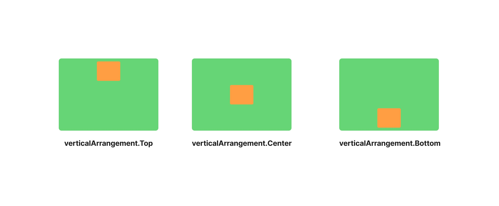
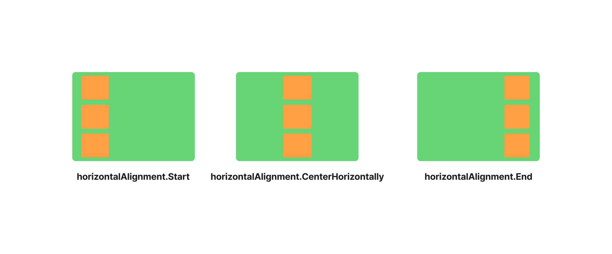
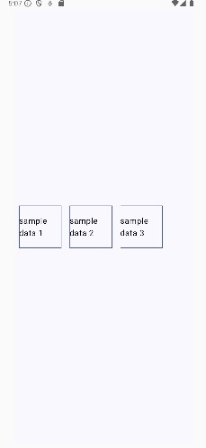

# Column과 Row로 내 맘대로 위젯 배치하기

[1. Column 알아보기](#section-1)  
[2. Row 알아보기](#section-2)  
[3. 코드로 알아보기](#section-3)

* * *

### <span id="section-1">1. Colum 알아보기</span>

Column을 사용할 때 매개변수까지 이용해서 하위 위젯들을 조정할 수 있다.


**Column**
- modifier: Modifier = Modifier
- verticalArrangement: Arrangement.Vertical = Arrangement.Top
- horizontalAlignment: Alignment.Horizontal = Alignment.Start
- content: @Composable (ColumnScope.() -> Unit)

하나하나 알아보도록하자.

> **Note**:  modifier도 정말 중요하지만 아직 모디파이어를 익히기에는 기본기가 부족하다. 기본기를 익힌 후에 modifier를 익히는 것이 좋다.

- modifier: 위젯을 수정할 수 있는 요소로 이후 챕터에서 설명할 예정이다. 일단 위젯을 꾸미거나 변경할 수 있는 거라고만 알아두자.
- verticalArrangement: 수직방향으로 어디서부터 배치할 거냐고 묻는 것이다. Arrangement.Top은 위에서 부터 아래순서로 배치 하겠다는 것이다.
- horizontalAlignment: 수직으로 배치한 위젯들을 어떻게 정렬하겠냐고 묻는 것이다. Alignment.Start는 좌에서 우 순서로 배치 하겠다는 것이다.
- content: @Composable (ColumnScope.() -> Unit) : 하위 위젯이다. 따로 설정할 필요 없다. {}안에 배치하는 하위 위젯들을 의미하는 거다.

여기서 핵심은 verticalArrangement, horizontalAlignment 이 둘이다. 이 둘을 어떻게 설정하느냐에 따라 배치 시작점, 정렬 방식이 바뀐다.


<div>
  <p align="center">
  
  </p>
  <p align="center"><b>Column 수직 배치</b></p>
</div>
<div>
  <p align="center">
  
  </p>
  <p align="center"><b>Column 수평 정렬</b></p>
</div>


### <span id="section-2">2. Row 알아보기</span>

Row도 알아보자. 거의 비슷하니 Column을 이해 했다면 Row도 쉽게 이해 가능하다.


**Row**
- modifier: Modifier = Modifier
- horizontalArrangement: Arrangement.Horizontal = Arrangement.Start
- verticalAlignment: Alignment.Vertical = Alignment.Top
- content: @Composable (RowScope.() -> Unit)


- horizontalArrangement: 수평 방향으로 어디서부터 배치할 거냐고 묻는 것이다. Arrangement.Start는 좌에서 우 순서로 배치 하겠다는 것이다.
- horizontalAlignment: 수평으로 배치한 위젯들을 어떻게 정렬하겠냐고 묻는 것이다. Alignment.Top은 위에서 부터 아래순서로 배치 하겠다는 것이다.

중복되는 내용은 제외하고 저 두 가지만 설명했다. Column과 유사하면서도 다른 점은 **수평배치**와 **수직정렬**이다. Column은 수직배치, 수평정렬이었지만 Row는 수평배치와 수직정렬이다. 그림으로 빠르게 알아보자.


<div>
  <p align="center">
  
  </p>
  <p align="center"><b>Row 수평 배치</b></p>
</div>
<div>
  <p align="center">
  
  </p>
  <p align="center"><b>Row 수직 정렬</b></p>
</div>


### <span id="section-3">3. 코드로 알아보기</span>

위에서 설명한 내용을 코드로 살펴보자. 그리고 위에서 설명하지 않는 내용들도 코드로 보여주겠다.


```kt
@Composable
fun App() {
    Column(
        verticalArrangement = Arrangement.Center,
        horizontalAlignment = Alignment.CenterHorizontally,
        modifier = Modifier
            .fillMaxSize()
            .safeContentPadding()
            .background(MaterialTheme.colorScheme.background)
    ) {
        for(i in 0..2){
            Box(
                modifier = Modifier
                    .size(80.dp)
                    .padding(8.dp)
                    .background(MaterialTheme.colorScheme.primary)
            )
        }
    }
}

```

<p align="center">

</p>


```kt
@Composable
fun App() {
    Row(
        verticalAlignment = Alignment.CenterVertically,
        horizontalArrangement = Arrangement.Start,
        modifier = Modifier
            .fillMaxSize()
            .safeContentPadding()
            .background(MaterialTheme.colorScheme.background)
    ) {
        for(i in 0..2){
            Box(
                modifier = Modifier
                    .size(80.dp)
                    .padding(8.dp)
                    .background(MaterialTheme.colorScheme.primary)
            )
        }
    }
}
```


<p align="center">

</p>


특이한 점을 발견할 수 있는데

```kt
for(i in 0..2){
            Box(
                modifier = Modifier
                    .size(80.dp)
                    .padding(8.dp)
                    .background(MaterialTheme.colorScheme.primary)
            )
        }
```

이 부분이다. 똑같은 하위 위젯을 반복적으로 배치하는 경우가 많다. 실제로 커뮤니티 사이트같은 곳에 들어가면 내용만 다르고 구조는 똑같은 것들이 반복된 경우가 많은데 이런식으로 반복문으로 배치할 수 있다. 위 반복문은 예시이고 실제로는 Kotlin의 forEach문이 많이 쓰인다. 데이터가 리스트형태로 저장된 경우 리스트를 순회하며 위젯을 배치하면 된다.

```kt
@Composable
fun App() {
    Row(
        verticalAlignment = Alignment.CenterVertically,
        horizontalArrangement = Arrangement.Start,
        modifier = Modifier
            .fillMaxSize()
            .safeContentPadding()
            .background(MaterialTheme.colorScheme.background)
    ) {
        val sampleList: List<String> = listOf(
            "sample data 1",
            "sample data 2",
            "sample data 3",
        )

        sampleList.forEach { it ->
            Box(
                modifier = Modifier
                    .size(100.dp)
                    .padding(8.dp)
                    .border(
                        width = 1.dp,
                        color = MaterialTheme.colorScheme.primary,
                    )
            ){
                Text(
                    text = it,
                    modifier = Modifier.align(Alignment.Center),
                )
            }
        }
    }
}
```
<p align="center">

</p>

이런 식으로 사용하면 된다.

Column의 수직배치나 Row의 수평배치를 할 때 내가 원하는 간격으로 설정하거나 따로 설정하지 않아도 위젯들이 멀리 떨어져 버리거나 했으면 하는 생각이 들 때가 있다. Column으로 예시를 들테니 Row는 직접 실습을 해보길 바란다.

**Arrangement.spacedBy()**  이는 개발자가 원하는 간격으로 배치하겠다는 의미다.

```kt
@Composable
fun App() {
    Column(
        verticalArrangement = Arrangement.spacedBy(16.dp),
        horizontalAlignment = Alignment.CenterHorizontally,
        modifier = Modifier
            .fillMaxSize()
            .safeContentPadding()
            .background(MaterialTheme.colorScheme.background)
    ) {
        repeat(5){
            Box(
                modifier = Modifier
                    .size(100.dp)
                    .padding(8.dp)
                    .background(MaterialTheme.colorScheme.primary)
            )
        }
    }
}
```

이번에는 repeat이라는 것을 사용해서 보여줬다. repeat이나 for문은 프로토타이핑을 할 때 개발자가 편한 방법대로 사용하면 된다.

다음 나오는 세 가지 경우는 하위 위젯들이 알아서 배치되는데 간격을 알아서 조정하게끔 하는 것들이다. 본인이 원하는 케이스를 골라서 사용하면 된다.

<p>
  
</p>