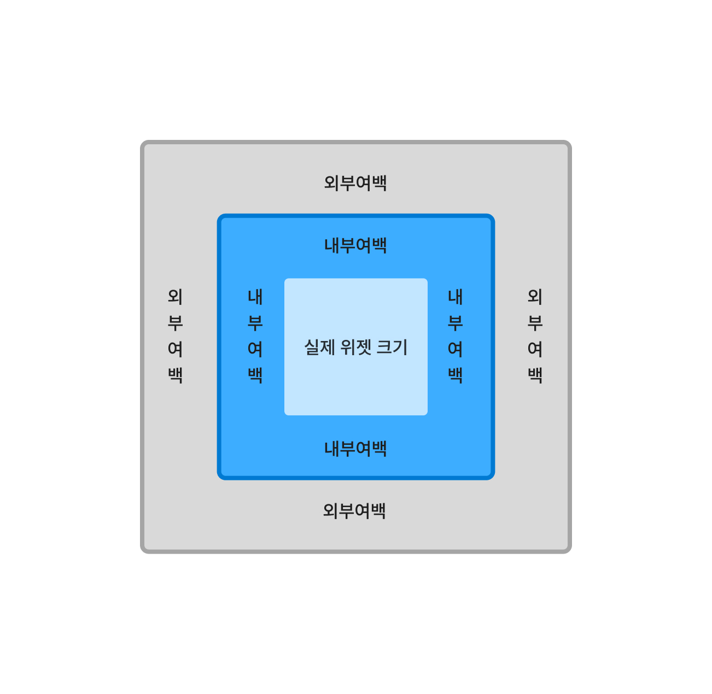

# Modifier는 어렵다
[1. padding으로 여백주기](#section-1)  
[2. 순서를 잘 지켜야 한다.](#section-2)  
[3. 내 맘대로 Modifier](#section-3)

* * *
### <span id="section-1">1. padding으로 여백주기</span>

Jetpack Compose에서 여백을 주는 방법은 padding으로 준다.  
이 padding에 대해 잘 이해하고 넘어가야 하는데, padding이라는 것은 '내부 여백'이다.



Modifier는 padding으로 내부여백만 줄 수 있다. 그런데 우리는 서로 다른 위젯 간에 간격을 줘야 한다. 즉, 외부 여백을 줘야 한다. Column이나 Row는 수직 배치, 수평 배치로 간격을 줄 수 있는데 그 이외에 방법으로 외부 여백을 주는 방법이 있을까? 물론 있다. 다음을 사용하면 된다.
```kt
Spacer(modifier = Modifier.height(8.dp))
 // 또는
Spacer(modifier = Modifier.width(8.dp))
```
Spacer는 빈 공간을 두겠다는 것이다. 모디파이어로 높이를 주면 위 아래로 간격을 줄 수 있고 너비를 주면 좌우로 여백을 줄 수 있다. 위 그림을 이해하면 이제 우리는 여백을 적용하는데 어려움이 없을 것이다.

### <span id="section-2">2. 순서를 잘 지켜야 한다.</span>

Modifier는 위젯을 수정할 수 있는 것이다. 수정에는 다양한 것들이 있는데, 배경색을 바꾸거나 그림자, 테두리, 크기 변경 등등 정말 다양한 것들을 할 수 있다. 큰 제목에 Modifier는 어렵다라고 했는데, 누구에게나 당연한 말이지만 적응하면 쉽다. 어렵다고 말한 이유는 아래에서 실습을 진행하면서 알게되겠지만 모디파이어의 가장 큰 특징은 **순서**다.

```kt
Box(
            modifier = Modifier
                .size(200.dp)
                .padding(20.dp)
                .background(MaterialTheme.colorScheme.primary)
        )
```

이러한 모디파이어 예시가 있다. 위 박스의 모디파이어를 다음과 같이 바꿨다.

```kt
Box(
            modifier = Modifier
                .size(200.dp)
                .background(MaterialTheme.colorScheme.primary)
                .padding(20.dp)
        )
```

실행 해보면 크기가 달라지는 것을 볼 수 있다.

예시를 하나 더 보겠다.

```kt
Box(
            modifier = Modifier
                .size(200.dp)
                .background(MaterialTheme.colorScheme.primaryContainer)
                .clickable(
                    onClick = {println("Test")},
                )
                .padding(50.dp)
        )
```

위 코드는 박스 위젯에 clickable 모디파이어를 추가해서 클릭이 가능하게 만들었다. 버튼처럼 동작을 한다. 박스 위젯 영역 어디를 클릭하든 클릭이 잘 되는 것을 확인할 수 있다. 이제 순서를 바꿔 보겠다.

```kt
Box(
            modifier = Modifier
                .size(200.dp)
                .background(MaterialTheme.colorScheme.primaryContainer)
                .padding(50.dp)
                .clickable(
                    onClick = {println("Test")},
                )
        )
```

이제 박스를 클릭 해보는데 중심부를 클릭 하지말고 테두리쪽을 클릭 해봐라. 클릭이 안된다.

**예시 설명**

- 박스 크기 예시
    1)  첫 번째에서는 박스의 크기를 200으로 설정한 뒤 padding으로 여백을 주고 마지막에 색칠을 하였다. 그럼 여백까지 반영이 된 상태로 색칠이 되니 눈에 보이는 박스의 크기가 줄어든다.
    2)  두 번째에서는 박스의 크기를 200으로 설정하고 색칠을 한 뒤 여백을 주었다. 색을 이미 칠하고나서 여백을 주니 눈에 보이는 박스의 크기는 그대로이다.

- 클릭이 되는 박스 예시
    1)  첫 번째에서는 clickable을 주고 여백을 주어서 클릭의 영역이 200이다.
    2)  두 번째에서는 여백을 주고 clickable을 주어서 클릭의 영역은 줄어든다.

이 순서를 잘 지켜야만 원하는 결과를 얻을 수 있다.


### <span id="section-3">3. 내 맘대로 Modifier</span>

Modifier를 커스터마이징 하고 그 Modifier를 넘겨 받아서 사용할 수 있다. 다음 예제를 보자.

```kt
@Composable
fun App() {
    Column(
        verticalArrangement = Arrangement.SpaceEvenly,
        horizontalAlignment = Alignment.CenterHorizontally,
        modifier = Modifier
            .fillMaxSize()
            .safeContentPadding()
            .background(MaterialTheme.colorScheme.background)
    ) {
        Box(
            modifier = Modifier
                .size(100.dp)
                .background(MaterialTheme.colorScheme.error)
        )
        Box(
            modifier = Modifier
                .size(100.dp)
                .background(MaterialTheme.colorScheme.error)
        )
        Box(
            modifier = Modifier
                .size(100.dp)
                .background(MaterialTheme.colorScheme.error)
        )
        Box(
            modifier = Modifier
                .size(100.dp)
                .background(MaterialTheme.colorScheme.error)
        )
    }
}
```

Box위젯에 Modifier가 반복되는 것을 볼 수 있다. 이 예시는 Box위젯 자체가 반복되어서 반복문으로 해결할 수 있지만, 모디파이어만 반복되는 경우가 있다. 그럴 때 공통되는 코드를 추출해놓고 재사용할 수 있으면 좋지 않겠나? Modifier도 재사용이 가능하다.

Modifier 재사용은 다음과 같이 할 수 있다.

```kt
fun Modifier.myBoxModifier(color: Color): Modifier{
    return Modifier
        .size(100.dp)
        .background(color)
}

@Composable
fun App() {
    Column(
        verticalArrangement = Arrangement.SpaceEvenly,
        horizontalAlignment = Alignment.CenterHorizontally,
        modifier = Modifier
            .fillMaxSize()
            .safeContentPadding()
            .background(MaterialTheme.colorScheme.background)
    ) {
        Box(
            modifier = Modifier
                .myBoxModifier(MaterialTheme.colorScheme.error)
        )
        Box(
            modifier = Modifier
                .myBoxModifier(MaterialTheme.colorScheme.error)
        )
        Box(
            modifier = Modifier
                .myBoxModifier(MaterialTheme.colorScheme.error)
        )
        Box(
            modifier = Modifier
                .myBoxModifier(MaterialTheme.colorScheme.error)
        )
    }
}
```

이렇게 하면 공통으로 사용하는 모디파이어를 반복하지 않고 재사용할 수 있다.