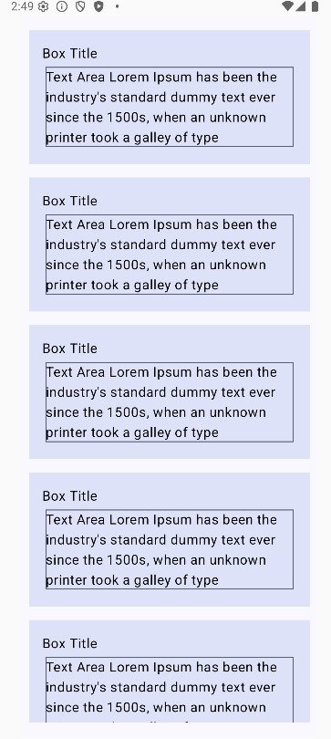
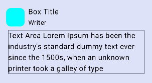
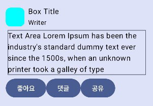
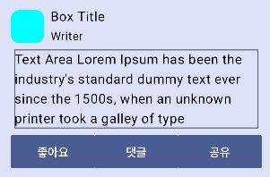

# 공통된 요소가 나열된 구성을 만들어보자
* * *

새 프로젝트를 만들고 다음과 같이 구성하자.

MainActivity.kt
```kt
class MainActivity : ComponentActivity() {
    override fun onCreate(savedInstanceState: Bundle?) {
        super.onCreate(savedInstanceState)
        enableEdgeToEdge()
        setContent {
            WikiAppTheme {
                App()
            }
        }
    }
}
```

그리고 MainActivity.kt파일이 있는 폴더에 App이라는 코틀린 파일을 만들고 다음과 같이 만들자.

App.kt
```kt
@Composable
fun App() {
    Box(
        modifier = Modifier
            .fillMaxSize()
            .safeContentPadding()
    ) {
        Column(
            verticalArrangement = Arrangement.spacedBy(16.dp),
            modifier = Modifier
                .fillMaxSize()
                .background(MaterialTheme.colorScheme.background)
                .padding(vertical = 16.dp, horizontal = 8.dp),
        ) {
            repeat(10) {
                Box(
                    modifier = Modifier
                        .fillMaxWidth()
                        .height(160.dp)
                        .background(MaterialTheme.colorScheme.secondaryContainer)
                )
            }
        }
    }
}
```

이러면 10개의 박스가 밑으로 나열된다. 그런데 10개를 만든 상태에서 나머지도 볼 수 있어야 하는데 박스의 크기 때문에 나머지가 보이지 않는다. 이럴 경우 박스의 크기를 줄이는 방식을 선택하면 내가 원하는 디자인을 할 수가 없다. 평소에 앱을 사용하면서 스크롤을 많이 사용한 경험이 있을거다. 스크롤 기능을 추가해보자.

App.kt
```kt
@Composable
fun App() {
    Box(
        modifier = Modifier
            .fillMaxSize()
            .safeContentPadding()
    ) {
        Column(
            verticalArrangement = Arrangement.spacedBy(16.dp),
            modifier = Modifier
                .fillMaxSize()
                .background(MaterialTheme.colorScheme.background)
                .padding(vertical = 16.dp, horizontal = 8.dp)
                .verticalScroll(rememberScrollState()),
        ) {
            repeat(10) {
                Box(
                    modifier = Modifier
                        .fillMaxWidth()
                        .height(160.dp)
                        .background(MaterialTheme.colorScheme.secondaryContainer)
                )
            }
        }
    }
}
```

이러면 수직방향으로 스크롤 할 수 있다. 이제 박스 내부를 채워보자.

App.kt
```kt
@Composable
fun App() {
    Box(
        modifier = Modifier
            .fillMaxSize()
            .safeContentPadding()
    ) {
        Column(
            verticalArrangement = Arrangement.spacedBy(16.dp),
            modifier = Modifier
                .fillMaxSize()
                .background(MaterialTheme.colorScheme.background)
                .padding(vertical = 16.dp, horizontal = 8.dp)
                .verticalScroll(rememberScrollState()),
        ) {
            repeat(10) {
                Box(
                    modifier = Modifier
                        .fillMaxWidth()
                        .height(160.dp)
                        .background(MaterialTheme.colorScheme.secondaryContainer)
                ){
                    Column(
                        modifier = Modifier
                            .fillMaxWidth()
                            .padding(16.dp)
                    ) {
                        Text(
                            text = "Box Title",
                        )
                        Box(
                            modifier = Modifier
                                .fillMaxWidth()
                                .height(160.dp)
                                .padding(4.dp)
                                .border(1.dp, MaterialTheme.colorScheme.secondary)
                        ){
                            Text(
                                text = "Text Area Lorem Ipsum has been the industry's " +
                                        "standard dummy text ever since the 1500s, " +
                                        "when an unknown printer took a galley of type "
                            )
                        }
                    }
                }
            }
        }
    }
}
```
<p align="center">
      
</p>

이런식의 결과가 나온다.  
보통 SNS를 하면 저런 식의 나열이 흔한데 프로필 이미지라던가 작성자이름이라던가 많이 부족하다. 그런 것들을 추가해보자.

App.kt
```kt
@Composable
fun App() {
    Box(
        modifier = Modifier
            .fillMaxSize()
            .safeContentPadding()
    ) {
        Column(
            verticalArrangement = Arrangement.spacedBy(16.dp),
            modifier = Modifier
                .fillMaxSize()
                .background(MaterialTheme.colorScheme.background)
                .padding(vertical = 16.dp, horizontal = 8.dp)
                .verticalScroll(rememberScrollState()),
        ) {
            repeat(10) {
                Box(
                    modifier = Modifier
                        .fillMaxWidth()
                        .background(MaterialTheme.colorScheme.secondaryContainer)
                ){
                    Column(
                        modifier = Modifier
                            .fillMaxWidth()
                            .padding(16.dp)
                    ) {
                        Row(
                            verticalAlignment = Alignment.CenterVertically,
                        ) {
                         [[MARK]]
                            Box(
                                modifier = Modifier
                                    .size(40.dp)
                                    .clip(
                                        shape = RoundedCornerShape(10.dp)
                                    )
                                    .background(Color.Cyan)
                            )
                            Spacer(modifier = Modifier.size(8.dp))[[/MARK]]
                            Text(
                                text = "Box Title",
                            )
                        }
                        Box(
                            modifier = Modifier
                                .fillMaxWidth()
                                .padding(4.dp)
                                .border(1.dp, MaterialTheme.colorScheme.secondary)
                        ){
                            Text(
                                text = "Text Area Lorem Ipsum has been the industry's " +
                                        "standard dummy text ever since the 1500s, " +
                                        "when an unknown printer took a galley of type "
                            )
                        }
                    }
                }
            }
        }
    }
}
```

주의 할 것이 있는데 지금 .height()를 없애서 높이 제한을 없앴다. 보통 너비를 먼저 결정하고 높이는 컨텐츠를 계속 채워넣으면서 결정하려고 그런것이다.

Box Title이란 Text위젯을 Row로 감싸면서 Box와 Text를 하위 위젯으로 삼았다. 그리고 CenterVertically로 정렬을 하였다. 이번에는 Box Title밑에 Writer를 추가할 것이다. 어디를 바꾸면 될까? 간단하다. BoxTitle를 Column으로 감싸고 Text를 하나 더 추가하면 된다!

```kt
Row(
                            verticalAlignment = Alignment.CenterVertically,
                        ) {
                            Box(
                                modifier = Modifier
                                    .size(40.dp)
                                    .clip(
                                        shape = RoundedCornerShape(10.dp)
                                    )
                                    .background(Color.Cyan)
                            )
                            Spacer(modifier = Modifier.size(8.dp))
                            [[MARK]]
                            Column {
                                Text(
                                    text = "Box Title",
                                )
                                Text(
                                    text = "Writer",
                                    fontSize = 14.sp
                                )
                            }
                        }[[/MARK]]
```

<p align="center">
      
</p>

이제 버튼 세 개를 추가할 건데 좋아요, 댓글, 공유 순으로 만들거다. 버튼 세 개를 수평으로 나열하는 거면 무엇을 쓰면 될까? Row를 쓰고 그 안에 버튼을 세 개 만들면 된다!

App.kt
```kt
@Composable
fun App() {
    Box(
        modifier = Modifier
            .fillMaxSize()
            .safeContentPadding()
    ) {
        Column(
            verticalArrangement = Arrangement.spacedBy(16.dp),
            modifier = Modifier
                .fillMaxSize()
                .background(MaterialTheme.colorScheme.background)
                .padding(vertical = 16.dp, horizontal = 8.dp)
                .verticalScroll(rememberScrollState()),
        ) {
            repeat(10) {
                Box(
                    modifier = Modifier
                        .fillMaxWidth()
                        .background(MaterialTheme.colorScheme.secondaryContainer)
                ){
                    Column(
                        modifier = Modifier
                            .fillMaxWidth()
                            .padding(16.dp)
                    ) {
                        Row(
                            verticalAlignment = Alignment.CenterVertically,
                        ) {
                            Box(
                                modifier = Modifier
                                    .size(40.dp)
                                    .clip(
                                        shape = RoundedCornerShape(10.dp)
                                    )
                                    .background(Color.Cyan)
                            )
                            Spacer(modifier = Modifier.size(8.dp))
                            Column {
                                Text(
                                    text = "Box Title",
                                )
                                Text(
                                    text = "Writer",
                                    fontSize = 14.sp
                                )
                            }
                        }
                        Box(
                            modifier = Modifier
                                .fillMaxWidth()
                                .padding(4.dp)
                                .border(1.dp, MaterialTheme.colorScheme.secondary)
                        ){
                            Text(
                                text = "Text Area Lorem Ipsum has been the industry's " +
                                        "standard dummy text ever since the 1500s, " +
                                        "when an unknown printer took a galley of type "
                            )
                        }
                        Row(){
                            Button(
                                onClick = {  },
                            ) {
                                Text("좋아요")
                            }
                            Button(
                                onClick = {  },
                            ) {
                                Text("댓글")
                            }
                            Button(
                                onClick = {  },
                            ) {
                                Text("공유")
                            }
                        }
                    }
                }
            }
        }
    }
}
```

<p align="center">
      
</p>

만들긴 했는데 정돈이 너무 안되어있다. 모디파이어나 속성을 이용해서 정리를 해보자.

```kt
Row(
                            modifier = Modifier.fillMaxWidth(),
                        ){
                            Button(
                                onClick = {  },
                                shape = RoundedCornerShape(1.dp),
                                [[MARK]]
                                modifier = Modifier.weight(1f)[[/MARK]]
                            ) {
                                Text("좋아요")
                            }
                            Button(
                                onClick = {  },
                                shape = RoundedCornerShape(1.dp),
                               [[MARK]]
                                modifier = Modifier.weight(1f)[[/MARK]]
                            ) {
                                Text("댓글")
                            }
                            Button(
                                onClick = {  },
                                shape = RoundedCornerShape(1.dp),
                                [[MARK]]
                                modifier = Modifier.weight(1f)[[/MARK]]
                            ) {
                                Text("공유")
                            }
                        }
```

<p align="center">
      
</p>

강조한 표시 부분을 보면 weight(1f)라고 되어 있는데 이건 남아있는 영역을 알아서 차지하라는 의미다. 같은 위계에 있는 위젯들간에 숫자가 더 높은 위젯이 더 많은 영역을 가지고 가는데, 위 예제는 셋 다 같은 숫자이니 동일하게 나눠 가진다.

마무리로 정리를 한 번 해볼까한다. 최상위 박스에서 바로 밑에 있는 컬럼을 다른 파일로 내보내서 관리하려한다.

App.kt
```kt
@Composable
fun App() {
    Box(
        modifier = Modifier
            .fillMaxSize()
            .safeContentPadding()
    ) {
    [[MARK]]
        Column(
            verticalArrangement = Arrangement.spacedBy(16.dp),
            modifier = Modifier
                .fillMaxSize()
                .background(MaterialTheme.colorScheme.background)
                .padding(vertical = 16.dp, horizontal = 8.dp)
                .verticalScroll(rememberScrollState()),
        ) {
            repeat(10) {
                Box(
                    modifier = Modifier
                        .fillMaxWidth()
                        .background(MaterialTheme.colorScheme.secondaryContainer)
                ){
                    Column(
                        modifier = Modifier
                            .fillMaxWidth()
                            .padding(16.dp)
                    ) {
                        Row(
                            verticalAlignment = Alignment.CenterVertically,
                        ) {
                            Box(
                                modifier = Modifier
                                    .size(40.dp)
                                    .clip(
                                        shape = RoundedCornerShape(10.dp)
                                    )
                                    .background(Color.Cyan)
                            )
                            Spacer(modifier = Modifier.size(8.dp))
                            Column {
                                Text(
                                    text = "Box Title",
                                )
                                Text(
                                    text = "Writer",
                                    fontSize = 14.sp
                                )
                            }
                        }
                        Box(
                            modifier = Modifier
                                .fillMaxWidth()
                                .padding(4.dp)
                                .border(1.dp, MaterialTheme.colorScheme.secondary)
                        ){
                            Text(
                                text = "Text Area Lorem Ipsum has been the industry's " +
                                        "standard dummy text ever since the 1500s, " +
                                        "when an unknown printer took a galley of type "
                            )
                        }
                        Row(
                            modifier = Modifier.fillMaxWidth(),
                        ){
                            Button(
                                onClick = {  },
                                shape = RoundedCornerShape(1.dp),
                                modifier = Modifier.weight(1f)
                            ) {
                                Text("좋아요")
                            }
                            Button(
                                onClick = {  },
                                shape = RoundedCornerShape(1.dp),
                                modifier = Modifier.weight(1f)
                            ) {
                                Text("댓글")
                            }
                            Button(
                                onClick = {  },
                                shape = RoundedCornerShape(1.dp),
                                modifier = Modifier.weight(1f)
                            ) {
                                Text("공유")
                            }
                        }
                    }
                }
            }
        }[[/MARK]]
    }
}
```

표시된 영역을 MainActivity.kt 파일이 있는 폴더에 BoxList.kt라는 파일로 만들어서 그 안에 붙인다.

BoxList.kt
```kt
@Composable
fun BoxList(){
    Column(
        verticalArrangement = Arrangement.spacedBy(16.dp),
        modifier = Modifier
            .fillMaxSize()
            .background(MaterialTheme.colorScheme.background)
            .padding(vertical = 16.dp, horizontal = 8.dp)
            .verticalScroll(rememberScrollState()),
    ) {
        repeat(10) {
            Box(
                modifier = Modifier
                    .fillMaxWidth()
                    .background(MaterialTheme.colorScheme.secondaryContainer)
            ){
                Column(
                    modifier = Modifier
                        .fillMaxWidth()
                        .padding(16.dp)
                ) {
                    Row(
                        verticalAlignment = Alignment.CenterVertically,
                    ) {
                        Box(
                            modifier = Modifier
                                .size(40.dp)
                                .clip(
                                    shape = RoundedCornerShape(10.dp)
                                )
                                .background(Color.Cyan)
                        )
                        Spacer(modifier = Modifier.size(8.dp))
                        Column {
                            Text(
                                text = "Box Title",
                            )
                            Text(
                                text = "Writer",
                                fontSize = 14.sp
                            )
                        }
                    }
                    Box(
                        modifier = Modifier
                            .fillMaxWidth()
                            .padding(4.dp)
                            .border(1.dp, MaterialTheme.colorScheme.secondary)
                    ){
                        Text(
                            text = "Text Area Lorem Ipsum has been the industry's " +
                                    "standard dummy text ever since the 1500s, " +
                                    "when an unknown printer took a galley of type "
                        )
                    }
                    Row(
                        modifier = Modifier.fillMaxWidth(),
                    ){
                        Button(
                            onClick = {  },
                            shape = RoundedCornerShape(1.dp),
                            modifier = Modifier.weight(1f)
                        ) {
                            Text("좋아요")
                        }
                        Button(
                            onClick = {  },
                            shape = RoundedCornerShape(1.dp),
                            modifier = Modifier.weight(1f)
                        ) {
                            Text("댓글")
                        }
                        Button(
                            onClick = {  },
                            shape = RoundedCornerShape(1.dp),
                            modifier = Modifier.weight(1f)
                        ) {
                            Text("공유")
                        }
                    }
                }
            }
        }
    }
}
```

App.kt를 다음과 같이 수정한다.

App.kt
```kt
@Composable
fun App() {
    Box(
        modifier = Modifier
            .fillMaxSize()
            .safeContentPadding()
    ) {
        BoxList()
    }
}
```

이런식으로 컴포저블을 모듈화해서 사용할 수 있다. 지금 이렇게 하는 이유는 예제를 진행하면서 화면을 계속 변경할 것이라 계속 지웠다 썼다 하기보다 따로 빼낸 뒤 새로 하나 만들어서 BoxList만 다른 걸로 바꿔주기만 하게끔 만든 것이다.
이렇게 할 수 있다면 나열된 요소도 따로 빼내서 관리할 수 있을 것이다. 