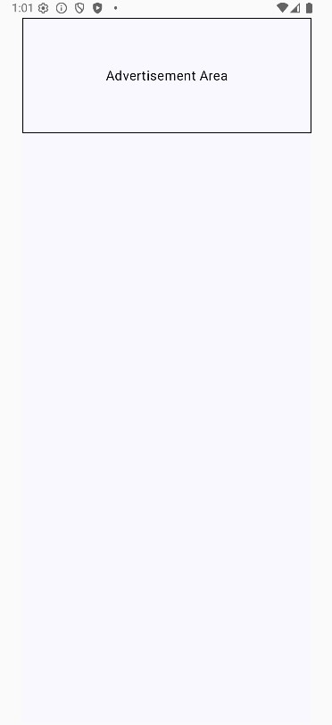
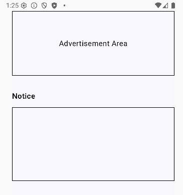
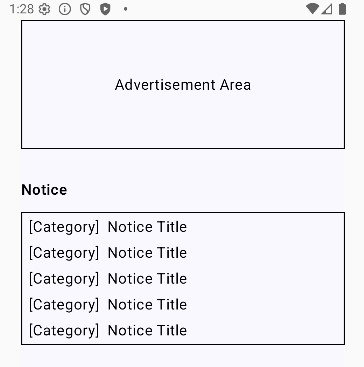
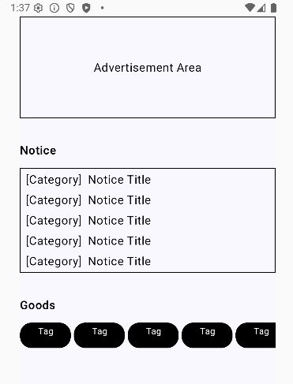
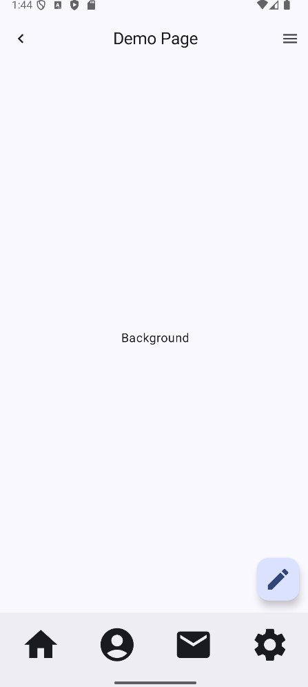

# 리스트 형태는 굉장히 많이 사용한다.

이전 장에서 리스트를 만들었고 그 리스트 요소에 내용을 채워넣는 것을 해보았다. 이번에는 조금 더 난이도 있는 형태로 만들어보자. 쇼핑몰 형태를 간소하게 만들어 볼 것이다.

MainActivity.kt가 있는 폴더에 DemoShop.kt이라는 컴포저블 파일을 만들고 App.kt를 BoxList를 DemoShop으로 바꾼다.

```kt
@Composable
fun App() {
    Box(
        modifier = Modifier
            .fillMaxSize()
            .safeContentPadding()
    ) {
        DemoShop()
    }
}
```

그 다음 DemoShop을 펼쳐서 아래와 같이 입력한다.

```kt
@Composable
fun DemoShop() {
    Box(
        modifier = Modifier
            .fillMaxSize()
            .background(MaterialTheme.colorScheme.background)
    ){
        
    }
}
```

우선 배경을 만들어주고 아래와 같이 배너 영역을 추가한다.

```kt
@Composable
fun DemoShop() {
    Box(
        modifier = Modifier
            .fillMaxSize()
            .background(color = MaterialTheme.colorScheme.background)
    ){
        Column(
            modifier = Modifier
                .fillMaxSize(),
        ) {
            Box(
                modifier = Modifier
                    .fillMaxWidth()
                    .height(140.dp)
                    .border(1.dp,  Color.Black),
            ){
                Text(
                    text = "Advertisement Area",
                    modifier = Modifier
                        .align(Alignment.Center)
                )
            }
        }
    }
}
```

<p align="center">
      
</p>

높이를 고정해뒀다. 보통 배너에 들어가는 것들은 규격을 정해놓기 때문에 고정해두었다.

밑에는 공지사항을 둘 것이다. 수정해보자.

```kt
@Composable
fun DemoShop() {
    Box(
        modifier = Modifier
            .fillMaxSize()
            .background(color = MaterialTheme.colorScheme.background)
    ){
        Column(
            modifier = Modifier
                .fillMaxSize(),
            verticalArrangement = Arrangement.spacedBy(12.dp),
        ) {
            Box(
                modifier = Modifier
                    .fillMaxWidth()
                    .height(140.dp)
                    .border(1.dp,  Color.Black),
            ){
                Text(
                    text = "Advertisement Area",
                    modifier = Modifier
                        .align(Alignment.Center)
                )
            }
            Spacer(modifier = Modifier.height(8.dp))
            Text(
                text = "Notice",
                fontSize = 16.sp,
                fontWeight = FontWeight.SemiBold,
            )
            Column(
                modifier = Modifier
                    .fillMaxWidth()
                    .height(160.dp)
                    .border(1.dp, Color.Black),
            ) {
            }
        }
    }
}
```

<p align="center">
      
</p>

처음 영역을 잡을 때는 .height() 모디파이어로 고정된 높이를 주는 것이 좋다. 그 이후 어떤 스타일로 만들거냐에 따라서 모디파이어를 그대로 두거나 .height()를 지우고 하위 컨텐츠를 채워넣는대로 높이가 계속 늘어나는 식으로 가거나 선택하면 된다. 이 경우에도 구현하는 방법은 여러가지이니 앞으로 학습해가면서 선택하면 된다.

이제 공지사항 영역에 공지사항들을 추가 해보자.

```kt
@Composable
fun DemoShop() {
    Box(
        modifier = Modifier
            .fillMaxSize()
            .background(color = MaterialTheme.colorScheme.background)
    ){
        Column(
            modifier = Modifier
                .fillMaxSize(),
            verticalArrangement = Arrangement.spacedBy(12.dp),
        ) {
            Box(
                modifier = Modifier
                    .fillMaxWidth()
                    .height(140.dp)
                    .border(1.dp,  Color.Black),
            ){
                Text(
                    text = "Advertisement Area",
                    modifier = Modifier
                        .align(Alignment.Center)
                )
            }
            Spacer(modifier = Modifier.height(8.dp))
            Text(
                text = "Notice",
                fontSize = 16.sp,
                fontWeight = FontWeight.SemiBold,
            )
            Column(
                modifier = Modifier
                    .fillMaxWidth()
                    .border(1.dp, Color.Black)
                    .padding(vertical = 4.dp, horizontal = 8.dp),
                verticalArrangement = Arrangement.spacedBy(4.dp),
            ) {
                repeat(5) {
                    Row(
                        horizontalArrangement = Arrangement.spacedBy(8.dp),
                    ) {
                        Text(text = "[Category]")
                        Text(text = "Notice Title")
                    }
                }
            }
        }
    }
}
```

<p align="center">
      
</p>

필자는  Column의 높이를 없애고 보여지는 컨텐츠의 개수를 제한 하는 방식을 택했다. 이유는 그냥 편하기 때문이다. 공지사항 한 줄의 높이만 정하면 전체 높이는 알아서 결정되기 때문이다.

이번에 만들어볼 것은 상품들을 나열한 리스트를 만들 것이다. 그 전에 상품을 카테고리별로 볼 수 있도록 카테고리 탭을 만들 것이다. 아래와 같이 수정해보자.

```kt
@Composable
fun DemoShop() {
    Box(
        modifier = Modifier
            .fillMaxSize()
            .background(color = MaterialTheme.colorScheme.background)
    ){
        Column(
            modifier = Modifier
                .fillMaxSize()
                .verticalScroll(rememberScrollState()),
            verticalArrangement = Arrangement.spacedBy(12.dp),
        ) {
            Box(
                modifier = Modifier
                    .fillMaxWidth()
                    .height(140.dp)
                    .border(1.dp, Color.Black),
            ){
                Text(
                    text = "Advertisement Area",
                    modifier = Modifier
                        .align(Alignment.Center)
                )
            }
            Spacer(modifier = Modifier.height(8.dp))
            Text(
                text = "Notice",
                fontSize = 16.sp,
                fontWeight = FontWeight.SemiBold,
            )
            Column(
                modifier = Modifier
                    .fillMaxWidth()
                    .border(1.dp, Color.Black)
                    .padding(vertical = 4.dp, horizontal = 8.dp),
                verticalArrangement = Arrangement.spacedBy(4.dp),
            ) {
                repeat(5) {
                    Row(
                        horizontalArrangement = Arrangement.spacedBy(8.dp),
                    ) {
                        Text(text = "[Category]")
                        Text(text = "Notice Title")
                    }
                }
            }
            Spacer(modifier = Modifier.height(8.dp))
            Text(
                text = "Goods",
                fontSize = 16.sp,
                fontWeight = FontWeight.SemiBold,
            )
            Row(
                horizontalArrangement = Arrangement.spacedBy(4.dp),
                modifier = Modifier.horizontalScroll(state = rememberScrollState())
            ){
                repeat(6) {
                    Text(
                        text = "Tag",
                        fontSize = 12.sp,
                        textAlign = TextAlign.Center,
                        color = Color.White,
                        modifier = Modifier
                            .clip(RoundedCornerShape(16.dp))
                            .width(70.dp)
                            .height(35.dp)
                            .background(Color.Black)
                    )
                }
            }
        }
    }
}
```

<p align="center">
      
</p>

탭의 개수가 많아서 화면에 다 보이지 않거나 화면에 다 보여지기 위해 강제로 크기가 작아질 수 있다. 그러한 문제를 수평 스크롤을 추가하여 해결하였다. 실행해서 수평으로 스크롤 하면 보이지 않던 탭들도 볼 수 있다.

이제 상품들을 나열할건데 한 줄에 두 개씩만 보여주는 형식으로 만들 것이다.  
이 때 고민해볼 것이 있는데, 우선 이 책을 읽는 여러분이 지금 바로 낼 만한 해답은 아래와 같은 형식일 것이다.

```kt
Column{
  Row()
  Row()
  Row()
  ...more
}
```

Row에 하위 위젯을 두 개 들어갈 정도만 설정하여 만드는 방법을 생각할 수 있다. 이렇게 해도 상관없다. 개발하는 방법에는 더 나은 해답은 있지만 정답은 없다. 나는 내가 생각하기에 더 나은 해답으로 만들어보려 한다.

```kt
@Composable
fun DemoShop() {
    Box(
        modifier = Modifier
            .fillMaxSize()
            .background(color = MaterialTheme.colorScheme.background)
    ){
        Column(
            modifier = Modifier
                .fillMaxSize()
                .verticalScroll(rememberScrollState()),
            verticalArrangement = Arrangement.spacedBy(12.dp),
        ) {
            Box(
                modifier = Modifier
                    .fillMaxWidth()
                    .height(140.dp)
                    .border(1.dp, Color.Black),
            ){
                Text(
                    text = "Advertisement Area",
                    modifier = Modifier
                        .align(Alignment.Center)
                )
            }
            Spacer(modifier = Modifier.height(8.dp))
            Text(
                text = "Notice",
                fontSize = 16.sp,
                fontWeight = FontWeight.SemiBold,
            )
            Column(
                modifier = Modifier
                    .fillMaxWidth()
                    .border(1.dp, Color.Black)
                    .padding(vertical = 4.dp, horizontal = 8.dp),
                verticalArrangement = Arrangement.spacedBy(4.dp),
            ) {
                repeat(5) {
                    Row(
                        horizontalArrangement = Arrangement.spacedBy(8.dp),
                    ) {
                        Text(text = "[Category]")
                        Text(text = "Notice Title")
                    }
                }
            }
            Spacer(modifier = Modifier.height(8.dp))
            Row(
                horizontalArrangement = Arrangement.SpaceBetween,
                modifier = Modifier.fillMaxWidth()
            ) {
                Text(
                    text = "Goods",
                    fontSize = 16.sp,
                    fontWeight = FontWeight.SemiBold,
                )
                Text(
                    text = "More...",
                    fontSize = 12.sp,
                    fontWeight = FontWeight.Normal,
                )
            }
            Row(
                horizontalArrangement = Arrangement.spacedBy(4.dp),
                modifier = Modifier.horizontalScroll(state = rememberScrollState())
            ){
                repeat(6) {
                    Text(
                        text = "Tag",
                        fontSize = 12.sp,
                        textAlign = TextAlign.Center,
                        color = Color.White,
                        modifier = Modifier
                            .clip(RoundedCornerShape(16.dp))
                            .width(70.dp)
                            .height(35.dp)
                            .background(Color.Black)
                    )
                }
            }
            FlowRow(
                modifier = Modifier
                    .fillMaxWidth(),
                maxItemsInEachRow = 2,
                horizontalArrangement = Arrangement.spacedBy(10.dp),
                verticalArrangement = Arrangement.spacedBy(10.dp),
            ){
                repeat(5) {
                    Box(
                        modifier = Modifier
                            .width(160.dp)
                            .height(210.dp)
                            .background(Color.Black)
                    )
                }
            }

        }
    }
}
```

처음 보는 위젯의 종류가 나타났다. FlowRow라는 것인데, Row처럼 수평으로 나열을 하면서 넘치거나 하는 경우가 발생하면 다음줄로 넘겨서 위젯을 배치 한다. 아래는 FlowRow의 매개변수 들이다.

```kt
public fun FlowRow(
    modifier: Modifier = Modifier,
    horizontalArrangement: Arrangement.Horizontal = Arrangement.Start,
    verticalArrangement: Arrangement.Vertical = Arrangement.Top,
    itemVerticalAlignment: Alignment.Vertical = Alignment.Top,
    maxItemsInEachRow: Int = Int.MAX_VALUE,
    maxLines: Int = Int.MAX_VALUE,
    content: @Composable (FlowRowScope.() -> Unit)
): Unit
```

FlowRow는 특이하게 수직 배치와 수평 배치 모두 설정할 수 있다. 넘치는 요소를 다음 줄로 넘기기 때문에 그러한 것들은 Column처럼 배치 방식을 선택할 수 있다. 여기서 눈여겨 볼 것은 maxItemsEachRow인데 이건 각 줄당 최대 몇 개만 배치할 거냐 묻는 것이다. 만약 2로 설정하면 한 줄에 위젯 두 개만 배치한다.

이 FlowRow로 아주 편하게 아래와 같이 위젯을 배치할 수 있다.

<p align="center">
      
</p>


이렇게 해서 간소화한 쇼핑몰 형태를 구성해봤다. 여러분이 조금씩 더 추가를 하면서 해보면 좋을 것들 몇 가지를 주겠다.

> 1. 바로 위에 FlowRow로 구성한 이미지에 잘 보면 Goods쪽과 같은 라인에 More...이라는 것이 있다. 필자가 이미 코딩은 해놨으나 어디서 어떻게 한 건지를 여러분이 찾아봐라.
> 2. 공지사항 한 줄 한 줄이 밋밋하다. 조회수도 추가해봐라. 조회수는 항상 공지사항 맨 오른쪽에 붙게해라. 중첩 Row와 Row의 수평 배치 방식을 이용하면 쉽게 구현 가능하다.
> 3. 광고, 공지사항 등 우리가 평소에 앱을 사용하듯이 클릭이 가능하게 만들어봐라 별다른 기능 없이 클릭만 가능하게 하면 된다.