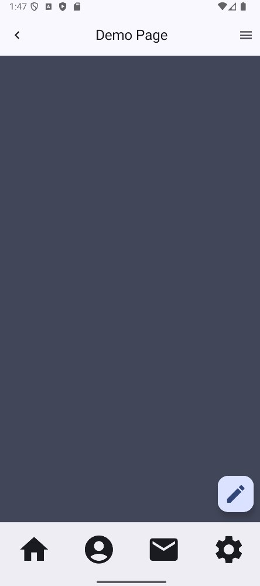

모바일 어플리케이션을 사용 하다보면 상단과 하단에 위젯이 고정되어 있는 것을 볼 수 있다. 이번 절에서는 Scaffold라는 것을 사용하여 앱의 상단과 하단을 채워넣을 것이다.

## 아무 이유 없이 공간을 채우는 것이 아니다
상단에 고정된 위젯을 탑바(TopBar), 하단에 고정된 위젯을 바텀바(BottomBar)라고 하겠다. 이 위젯들은 필요에 의해서 만드는 것이고 사용자들이 다른 화면으로 쉽게 이동할 수 있도록 제공하는 인터페이스일 가능성이 높다. 많이 사용되니 잘 알아두도록 하자.

DemoPage라는 파일과 함수를 만들고 App.kt에 DemoShop을 DemoPage로 변경하고 시작한다.

```kt
@Composable
fun App() {
    Box(
        modifier = Modifier
            .fillMaxSize()
            .safeContentPadding()
    ) {
        DemoPage()
    }
}
```

우선 Scaffold를 살펴보자

```kt
public fun Scaffold(
    modifier: Modifier = Modifier,  
    topBar: @Composable (() -> Unit) = {},  
    bottomBar: @Composable (() -> Unit) = {},  
    snackbarHost: @Composable (() -> Unit) = {},  
    floatingActionButton: @Composable (() -> Unit) = {},  
    floatingActionButtonPosition: FabPosition = FabPosition.End,  
    containerColor: Color = MaterialTheme.colorScheme.backg…,  
    contentColor: Color = contentColorFor(containerColor),  
    contentWindowInsets: WindowInsets = ScaffoldDefaults.contentWindowI…,  
    content: @Composable ((PaddingValues) -> Unit)  
): Unit
```

이번 절에서 눈여겨 볼 것들은 topBar와 bottomBar이다. 해당 매개변수에 들어갈 타입이 컴포저블로만 한정이 되어 있는데, 본인이 직접 위젯을 커스텀해서 넣어도 된다는 뜻이다. 하지만 주어진 것들이 있다면 그냥 쓰자.

다음과 같이 수정해보자

```kt
@OptIn(ExperimentalMaterial3Api::class, ExperimentalLayoutApi::class)
@Composable
fun DemoPage() {
    Scaffold(
        // 1. TopBar
        topBar = {
            TopAppBar(
                navigationIcon = {
                    IconButton(
                        onClick = { },
                    ) {
                        Icon(
                            imageVector = Icons.AutoMirrored.Default.KeyboardArrowLeft,
                            contentDescription = null
                        )
                    }
                },
                title = {
                    Text(
                        text = "Demo Page",
                        textAlign = TextAlign.Center,
                        modifier = Modifier.fillMaxWidth()
                    )
                },
                actions = {
                    IconButton(
                        onClick = { },
                    ) {
                        Icon(
                            imageVector = Icons.Default.Menu,
                            contentDescription = null
                        )
                    }
                }
            )
        },
        // 2. BottomBar
        bottomBar = {
            BottomAppBar(
            ) {
                Row(
                    modifier = Modifier.fillMaxWidth(),
                    horizontalArrangement = Arrangement.SpaceBetween,
                    verticalAlignment = Alignment.CenterVertically
                ) {
                    IconButton(
                        onClick = { },
                        modifier = Modifier
                            .fillMaxHeight()
                            .weight(1f)
                    ) {
                        Icon(
                            Icons.Filled.Home,
                            contentDescription = null,
                            modifier = Modifier.size(52.dp)
                        )
                    }
                    IconButton(
                        onClick = { },
                        modifier = Modifier
                            .fillMaxHeight()
                            .weight(1f)
                    ) {
                        Icon(
                            Icons.Filled.AccountCircle,
                            contentDescription = null,
                            modifier = Modifier.size(52.dp)
                        )
                    }
                    IconButton(
                        onClick = { },
                        modifier = Modifier
                            .fillMaxHeight()
                            .weight(1f)
                    ) {
                        Icon(
                            Icons.Filled.Email,
                            contentDescription = null,
                            modifier = Modifier.size(52.dp)
                        )
                    }
                    IconButton(
                        onClick = { println("Clicked") },
                        modifier = Modifier
                            .fillMaxHeight()
                            .weight(1f)
                    ) {
                        Icon(
                            Icons.Filled.Settings,
                            contentDescription = null,
                            modifier = Modifier.size(52.dp)
                        )
                    }
                }
            }
        },
        // 4. floattingButton
        floatingActionButton = {
            FloatingActionButton(
                onClick = { },
            ){
                Icon(
                    Icons.Filled.Edit,
                    contentDescription = null,
                    modifier = Modifier.size(36.dp)
                )
            }
        }
    ) { 
        // 3. Contents
        paddingValues ->
        Column (
            verticalArrangement = Arrangement.Center,
            horizontalAlignment = Alignment.CenterHorizontally,
            modifier = Modifier
                .fillMaxSize()
                .padding(paddingValues),
        ){
            Text(text = "Background")
        }
    }
}
```

전체 코드에서 주석이 달린 부분을 차례로 보자.

1번에서 TopAppBar라는 위젯을 사용했고 세 가지 핵심 요소가 있다.
- navigationIcon: TopAppBar기준으로 가장 왼쪽에 붙는 요소이다.
- title: navigationIcon 다음으로 오는 요소이다. 별도로 정렬하지 않으면 중앙정렬 되지 않으므로 모디파이어와 textAlign으로 중앙정렬 하였다.
- actions: action이 아닌 actions라는 것은 복수를 의미하는데 actions 내부에 여러 위젯을 배치하면 기본적으로 Row와 동일하게 수평으로 나열된다. 여러 위젯을 넣어도 되지만 필요한 것만 있으면 되니, 하나만 만들었다.

2번에서 BottomAppBar라는 위젯을 사용했고 바로 위에서 설명한 actions처럼 기본적으로 Row로 동작한다. 근데 필자는 Row에 최대너비로 주고 그 안에 아이콘들을 넣었는데 아이콘들을 쉽게 배치하기 위해서 Row를 사용했다. horizontalArrangement = Arrangement.SpaceBetween 옵션으로 쉽게 배치했다. 내부 위젯을 잘 보면 weight()이라는 모디파이어가 보이는데, 이 모디파이어는 반응형 UI를 적용할 때 쓰인다. 동일한 위계에 있는 위젯들끼리 가중치를 비교하여 가중치가 높은 만큼 더 넓은 영역을 차지하게 된다. 그리고 화면이 줄어들고 커짐에 따라 그 영역이 달라진다. 여기서는 모든 위젯이 동일한 영역을 차지하게 해야 보기 좋으니 모두에게 동일한 가중치를 부여했다.

3번은 위젯을 배치하는 영역이다. 한 가지 짚고 넘어가야할 것이 있는데 위젯을 배치하는 영역은 topbar와 bottombar를 제외한 영역이다.

<p align="center">
      
      
</p>

4번 플로팅 버튼은 위젯을 배치할 때 신경 쓰지 않아도 되는 위젯이다.