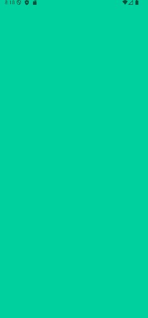
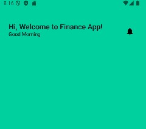
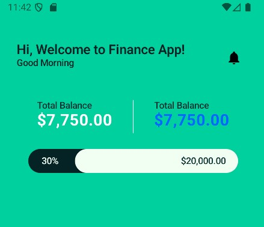
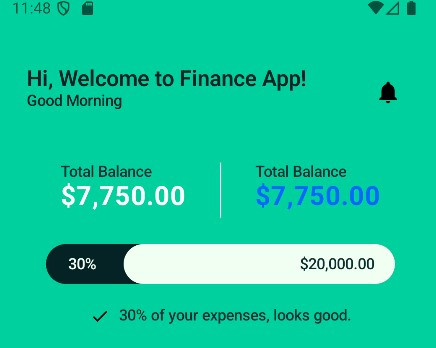
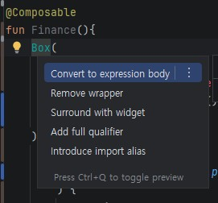
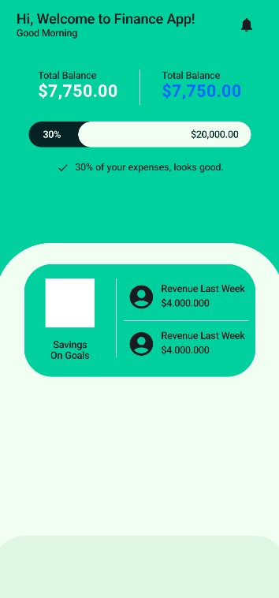
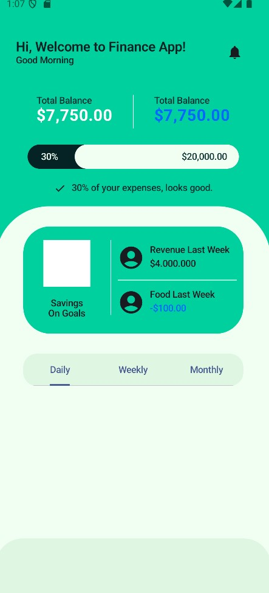
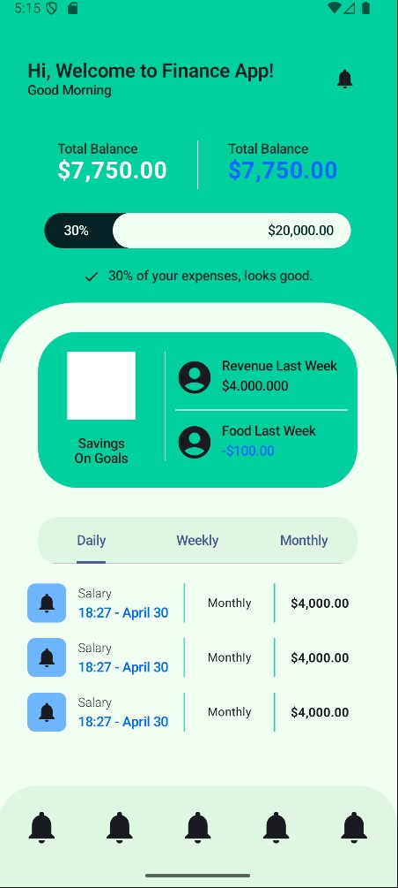

> 필자가 만든 것과 여러분이 펼친 디자인 파일에 나온 화면하고 좀 다를 것이다. 디자인 파일에 있는 아이콘들을 그대로 따라할 수는 있지만 일단 대강 비슷하게만 만들고 아이콘 같은 것들은 나중에 바꿔끼우기만 하면 되는 것이니 크게 신경 쓸 필요 없다. 그대로 따라하는 방법은 디자인 파일에서 아이콘을 선택하고 Design탭 맨 하단에 export를 누르고 SVG로 export해서 프로젝트로 불러오면 된다. 이 방법은 이후에 나오는 절에서 진행할 것이니 지금은 그냥 넘어가도 좋다.

이제 본격적으로 시작해보자. Finace라는 파일을 만들고 다음과 같이 입력하자.

```kt
@Composable
fun Finance(){
    Box(
        modifier = Modifier
            .background(MainGreen)
            .safeContentPadding()
            .fillMaxSize(),
    ){

    }
}

```


이러면 배경이 전부 채워졌을 것이다. 이제 디자인 파일을 보고 위에서 아래로 만들어 나가자.  텍스트 위젯이 눈에 띄는데 우측에 아이콘이 있을 것이다. 필자는 텍스트들과 아이콘을 한 줄로 묶어서 처리할 것이다. 아주 간단한 방법은 Row로 만들면 된다.

```kt
@Composable
fun Finance(){
    Box(
        modifier = Modifier
            .background(MainGreen)
            .safeContentPadding()
            .fillMaxSize(),
    ){
        Column(
            modifier = Modifier.padding(top = 40.dp,)
        ) {
            Row(
                horizontalArrangement = Arrangement.SpaceBetween,
                modifier = Modifier.fillMaxWidth()
            ) {
                Column {
                    Text(
                        text = "Hi, Welcome to Finance App!",
                        style = MaterialTheme.typography.titleLarge,
                        color = BackgroundDarkModeAndLetters
                    )
                    Text(
                        text = "Good Morning",
                        style = MaterialTheme.typography.titleSmall,
                        color = BackgroundDarkModeAndLetters
                    )
                }

                IconButton(onClick = {}) {
                    Box(
                        modifier = Modifier
                            .clip(shape = CircleShape)
                            .background(Color.White)
                    )
                    Icon(
                        imageVector = Icons.Filled.Notifications,
                        contentDescription = null,
                    )
                }
            }
        }
    }
}
```



```kt
//...생략

            Spacer(modifier = Modifier.height(40.dp))
            Row(
                modifier = Modifier.fillMaxWidth(),
                horizontalArrangement = Arrangement.SpaceEvenly,
            ){
                Column {
                    Text(
                        text = "Total Balance",
                        style = MaterialTheme.typography.titleSmall,
                        color = LettersAndIcons
                    )
                    Text(
                        text = "$7,750.00",
                        fontSize = 24.sp,
                        color = Color.White
                    )
                }
                VerticalDivider(
                    color = Color.White,
                    modifier = Modifier.height(50.dp)
                )
                Column {
                    Text(
                        text = "Total Balance",
                        style = MaterialTheme.typography.titleSmall,
                        color = LettersAndIcons
                    )
                    Text(
                        text = "$7,750.00",
                        fontSize = 24.sp,
                        color = OceanBlueButton
                    )
                }
            }
        }
```

VerticalDivider가 화면에 나오는 구분선이다. HorizontalDivider도 있으니 구분선으로 유용하게 쓸 수 있다.

```kt
//...생략
            Spacer(modifier = Modifier.height(24.dp))
            Box(
                modifier = Modifier
                    .align(Alignment.CenterHorizontally)
            ) {
                Box(
                    modifier = Modifier
                        .fillMaxWidth(0.9f)
                        .height(36.dp)
                        .clip(shape = RoundedCornerShape(20.dp))
                        .background(BackgroundDarkModeAndLetters)
                ){
                    Text(
                        text = "30%",
                        style = MaterialTheme.typography.titleSmall,
                        color = BackgroundGreenWhite,
                        textAlign = TextAlign.Center,
                        modifier = Modifier
                            .offset(x = 20.dp, y = 10.dp)
                    )
                }
                Box(
                    modifier = Modifier
                        .fillMaxWidth(0.7f)
                        .height(36.dp)
                        .clip(shape = RoundedCornerShape(20.dp))
                        .background(BackgroundGreenWhite)
                        .align(Alignment.TopEnd)
                ){
                    Text(
                        text = "$20,000.00",
                        style = MaterialTheme.typography.titleSmall,
                        color = LettersAndIcons,
                        modifier = Modifier
                            .offset(x = 160.dp, y = 10.dp)
                    )
                }
            }
```



이제 텍스트와 프로그레스바 비슷한 것이 보일 것이다. 실제 진행률을 반영하는 식으로 만들지 않았고 예제로만 만든 것이기에 진행률을 변경해도 위젯이 변경되지 않는다.

```kt
            Spacer(modifier = Modifier.height(20.dp))
            Row (
                modifier = Modifier
                    .align(Alignment.CenterHorizontally),
                horizontalArrangement = Arrangement.spacedBy(8.dp),
            ){
                Icon(
                    imageVector = Icons.Default.Check,
                    contentDescription = null,
                    modifier = Modifier
                        .size(18.dp)
                )
                Text(
                    text = "30% of your expenses, looks good.",
                    style = MaterialTheme.typography.titleSmall,
                    color = LettersAndIcons,
                    textAlign = TextAlign.Center,
                )
            }
```



하단 네비게이션 바를 만들기 위해 다소 귀찮을 수 있는 작업을 할 것이다. 지금까지 만든 것에 위젯을 하나 더 감쌀거다. Scaffold라는 위젯으로 감쌀건데 Scaffold로 감싸놓으면 TopBar, BottomBar를 간편하게 설정할 수 있다. Scaffold로 우리가 여태까지 만들었던 위젯을 감싸는데 안드로이드 스튜디오에서 간편하게 할 수 있다. 가장 최상위에 있는 Box에 커서를 두고 Alt+Enter를 누르면 다음과 같이 될 것이다.




여기서  Surround with widget을 선택하면 Box를 감싼채로 Container, Row, Column으로 감쌀건지 선택하라고 하는데 아무거나 선택한 뒤 Scaffold로 바꿔주고 다음과 같이 변경하도록 해라.

```kt
@Composable
fun Finance(){
    Scaffold { paddingValues ->
        Box(
            modifier = Modifier
                .background(MainGreen)
                .fillMaxSize()
                .padding(paddingValues),
        ) {
            Column
            //...생략
```

지금까지 만든 것들의 전부이다. 중간 중간에 필자가 수치를 변경한 것도 있으니 다시 한 번 되돌아볼겸 천천히 돌아보면서 값을 변경해두자.

```kt
@Composable
fun Finance(){
    Scaffold { paddingValues ->
        Box(
            modifier = Modifier
                .background(MainGreen)
                .fillMaxSize()
                .padding(paddingValues),
        ) {
            Column(
                modifier = Modifier.padding(
                    top = 40.dp,
                    start = 20.dp,
                    end = 20.dp,
                )
            ) {
                Row(
                    horizontalArrangement = Arrangement.SpaceBetween,
                    modifier = Modifier.fillMaxWidth()
                ) {
                    Column {
                        Text(
                            text = "Hi, Welcome to Finance App!",
                            style = MaterialTheme.typography.titleLarge,
                            color = BackgroundDarkModeAndLetters
                        )
                        Text(
                            text = "Good Morning",
                            style = MaterialTheme.typography.titleSmall,
                            color = BackgroundDarkModeAndLetters
                        )
                    }

                    IconButton(onClick = {}) {
                        Box(
                            modifier = Modifier
                                .clip(shape = CircleShape)
                                .background(Color.White)
                        )
                        Icon(
                            imageVector = Icons.Filled.Notifications,
                            contentDescription = null,
                        )
                    }
                }
                Spacer(modifier = Modifier.height(40.dp))
                Row(
                    modifier = Modifier.fillMaxWidth(),
                    horizontalArrangement = Arrangement.SpaceEvenly,
                ) {
                    Column {
                        Text(
                            text = "Total Balance",
                            style = MaterialTheme.typography.titleSmall,
                            color = LettersAndIcons
                        )
                        Text(
                            text = "$7,750.00",
                            fontSize = 24.sp,
                            color = Color.White,
                            fontWeight = FontWeight.Bold
                        )
                    }
                    VerticalDivider(
                        color = Color.White,
                        modifier = Modifier.height(50.dp)
                    )
                    Column {
                        Text(
                            text = "Total Balance",
                            style = MaterialTheme.typography.titleSmall,
                            color = LettersAndIcons
                        )
                        Text(
                            text = "$7,750.00",
                            fontSize = 24.sp,
                            color = OceanBlueButton,
                            fontWeight = FontWeight.Bold
                        )
                    }
                }
                Spacer(modifier = Modifier.height(24.dp))
                Box(
                    modifier = Modifier
                        .align(Alignment.CenterHorizontally)
                ) {
                    Box(
                        modifier = Modifier
                            .fillMaxWidth(0.9f)
                            .height(36.dp)
                            .clip(shape = RoundedCornerShape(20.dp))
                            .background(BackgroundDarkModeAndLetters)
                    ) {
                        Text(
                            text = "30%",
                            style = MaterialTheme.typography.titleSmall,
                            color = BackgroundGreenWhite,
                            textAlign = TextAlign.Center,
                            modifier = Modifier
                                .offset(x = 20.dp, y = 10.dp)
                        )
                    }
                    Box(
                        modifier = Modifier
                            .fillMaxWidth(0.7f)
                            .height(36.dp)
                            .clip(shape = RoundedCornerShape(20.dp))
                            .background(BackgroundGreenWhite)
                            .align(Alignment.TopEnd)
                    ) {
                        Text(
                            text = "$20,000.00",
                            style = MaterialTheme.typography.titleSmall,
                            color = LettersAndIcons,
                            modifier = Modifier
                                .offset(x = 160.dp, y = 10.dp)
                        )
                    }
                }
                Spacer(modifier = Modifier.height(20.dp))
                Row(
                    modifier = Modifier
                        .align(Alignment.CenterHorizontally),
                    horizontalArrangement = Arrangement.spacedBy(8.dp),
                ) {
                    Icon(
                        imageVector = Icons.Default.Check,
                        contentDescription = null,
                        modifier = Modifier
                            .size(18.dp)
                    )
                    Text(
                        text = "30% of your expenses, looks good.",
                        style = MaterialTheme.typography.titleSmall,
                        color = LettersAndIcons,
                        textAlign = TextAlign.Center,
                    )
                }
            }
        }
    }
}
```

다음은 바텀 네비게이션바와 화면 중, 하단을 만들것이다.

```kt
@Composable
fun Finance(){
    Scaffold(
        contentWindowInsets = WindowInsets(0, 0, 0, 0),
        bottomBar = {
            BottomAppBar(
                modifier = Modifier
                    .clip(
                        shape = RoundedCornerShape(
                            topStart = 40.dp,
                            topEnd = 40.dp,
                        )
                    ),
                containerColor = LightGreen,
            ) {

            }
        }
    )
//...생략, 박스위젯 내부 최하단
                Column(
                modifier = Modifier
                    .fillMaxWidth()
                    .height(520.dp)
                    .clip(
                        shape = RoundedCornerShape(
                            topStart = 80.dp,
                            topEnd = 80.dp,
                        )
                    )
                    .background(BackgroundGreenWhite)
                    .align(Alignment.BottomCenter)

            ) {
                Spacer(modifier = Modifier.height(30.dp))
                Row(
                    modifier = Modifier
                        .fillMaxWidth(0.8f)
                        .height(160.dp)
                        .clip(
                            shape = RoundedCornerShape(
                                40.dp
                            )
                        )
                        .background(MainGreen)
                        .align(Alignment.CenterHorizontally),
                ){

                }
            }
```

다음은 사각형 내부를 채워볼 것이다.

```kt
Spacer(modifier = Modifier.height(30.dp))
                 Row(
                    modifier = Modifier
                        .fillMaxWidth(0.8f)
                        .height(160.dp)
                        .clip(
                            shape = RoundedCornerShape(
                                40.dp
                            )
                        )
                        .background(MainGreen)
                        .align(Alignment.CenterHorizontally),
                ){
                    Column(
                        modifier = Modifier
                            .fillMaxHeight()
                            .padding(
                                vertical = 20.dp,
                                horizontal = 30.dp
                            ),
                        horizontalAlignment = Alignment.CenterHorizontally,
                    ) {
                        Box(
                            modifier = Modifier
                                .size(70.dp)
                                .background(Color.White)
                        )
                        Spacer(modifier = Modifier.height(16.dp))
                        Text(
                            text = "Savings\nOn Goals",
                            style = MaterialTheme.typography.titleSmall,
                            textAlign = TextAlign.Center,
                        )
                    }
                    VerticalDivider(
                        modifier = Modifier
                            .padding(top = 20.dp)
                            .fillMaxHeight(0.8f),
                        color = Color.White,
                    )
                    Column(
                        modifier = Modifier
                            .fillMaxHeight()
                            .padding(
                                vertical = 20.dp,
                                horizontal = 10.dp
                            ),
                        horizontalAlignment = Alignment.CenterHorizontally,
                        verticalArrangement = Arrangement.SpaceAround,
                    ){

                            Row(
                                horizontalArrangement = Arrangement.spacedBy(8.dp),
                            ){
                                Icon(
                                    imageVector = Icons.Default.AccountCircle,
                                    contentDescription = null,
                                    modifier = Modifier
                                        .size(40.dp)
                                )
                                Column(
                                    verticalArrangement = Arrangement.spacedBy(4.dp)
                                ){
                                    Text(
                                        text = "Revenue Last Week",
                                        style = MaterialTheme.typography.titleSmall,
                                    )
                                    Text(
                                        text = "$4.000.000",
                                        style = MaterialTheme.typography.titleSmall,
                                    )
                                }
                            }
                            HorizontalDivider(
                                modifier = Modifier.fillMaxWidth(),
                                color = Color.White,
                            )
                            Row(
                                horizontalArrangement = Arrangement.spacedBy(8.dp),
                            ){
                                Icon(
                                    imageVector = Icons.Default.AccountCircle,
                                    contentDescription = null,
                                    modifier = Modifier
                                        .size(40.dp)
                                )
                                Column(
                                    verticalArrangement = Arrangement.spacedBy(4.dp)
                                ){
                                    Text(
                                        text = "Revenue Last Week",
                                        style = MaterialTheme.typography.titleSmall,
                                    )
                                    Text(
                                        text = "$4.000.000",
                                        style = MaterialTheme.typography.titleSmall,
                                    )
                                }
                            }
                    }
                }
```




이제 하단에 탭을 만들것이다. 탭은 다른 화면을 보여주지 않고 그냥 따라만드는 것이니 여러화면을 만들고 싶은 사람은 공식문서를 참고 하면 탭별로 다른 컴포저블을 띄워볼 수 있다.
```kt
Row(
                            horizontalArrangement = Arrangement.spacedBy(8.dp),
                        ) {
                            Icon(
                                imageVector = Icons.Default.AccountCircle,
                                contentDescription = null,
                                modifier = Modifier
                                    .size(40.dp)
                            )
                            Column(
                                verticalArrangement = Arrangement.spacedBy(4.dp)
                            ) {
                                Text(
                                    text = "Food Last Week",
                                    style = MaterialTheme.typography.titleSmall,
                                )
                                Text(
                                    text = "-$100.00",
                                    color = OceanBlueButton,
                                    style = MaterialTheme.typography.titleSmall,
                                )
                            }
                        }
                    }
                }
                Spacer(modifier = Modifier.height(30.dp))
                PrimaryTabRow(
                    selectedTabIndex = 0,
                    containerColor = LightGreen,
                    modifier = Modifier
                        .fillMaxWidth(0.8f)
                        .clip(shape = RoundedCornerShape(20.dp)),
                ) {
                    Tab(
                        selected = true,
                        onClick = {},
                        text = {
                            Text(
                                text = "Daily",
                                style = MaterialTheme.typography.titleSmall,
                                )
                        }
                    )
                    Tab(
                        selected = false,
                        onClick = {},
                        text = {
                            Text(
                                text = "Weekly",
                                style = MaterialTheme.typography.titleSmall,
                            )
                        }
                    )
                    Tab(
                        selected = false,
                        onClick = {},
                        text = {
                            Text(
                                text = "Monthly",
                                style = MaterialTheme.typography.titleSmall,
                            )
                        }
                    )
                }
```





```kt
Column(  
    modifier = Modifier  
        .fillMaxWidth()  
        .padding(  
            vertical = 20.dp,  
            horizontal = 30.dp  
  ),  
    verticalArrangement = Arrangement.spacedBy(16.dp),  
) {  
  repeat(3) {  
	  Row(  
            modifier = Modifier  
                .fillMaxWidth(),  
            verticalAlignment = Alignment.CenterVertically,  
            horizontalArrangement = Arrangement.spacedBy(16.dp),  
        ) {  
			  Row(  
                verticalAlignment = Alignment.CenterVertically,  
                horizontalArrangement = Arrangement.spacedBy(12.dp),  
            ) {  
				  Icon(  
                    imageVector = Icons.Default.Notifications,  
                    contentDescription = null,  
                    modifier = Modifier  
                        .size(40.dp)  
                        .clip(shape = RoundedCornerShape(8.dp))  
                        .background(LightBlueButton)  
                        .padding(8.dp)  
                )  
                Column(  
                    verticalArrangement = Arrangement.spacedBy(4.dp)  
                ) {  
				  Text(  
                        text = "Salary",  
                        style = MaterialTheme.typography.bodyMedium,  
                    )  
                    Text(  
                        text = "18:27 - April 30",  
                        style = MaterialTheme.typography.titleSmall,  
                        color = OceanBlueButton,  
                    )  
                }  
			 }  		
			 VerticalDivider(  
                modifier = Modifier  
                    .height(40.dp)  
                    .width(1.dp),  
                color = MainGreen,  
            )  
  
            Text(  
                text = "Monthly",  
                textAlign = TextAlign.Center,  
                style = MaterialTheme.typography.bodySmall,  
                modifier = Modifier.width(60.dp)  
            )  
  
            VerticalDivider(  
                modifier = Modifier  
                    .height(40.dp)  
                    .width(1.dp),  
                color = MainGreen,  
            )  
  
            Text(  
                text = "$4,000.00",  
                style = MaterialTheme.typography.bodyMedium,  
                fontWeight = FontWeight.Bold,  
            )  
        }  
		 }
 }
```

이제 마지막 바텀 네비게이션만 남았다.
바텀 네비게이션은 코드 상단으로 돌아가서 작업한다.


```kt
@Composable  
fun Finance() {  
    Scaffold(  
        contentWindowInsets = WindowInsets(0, 0, 0, 0),  
        bottomBar = {  
		  BottomAppBar(  
                modifier = Modifier  
                    .clip(  
                        shape = RoundedCornerShape(  
                            topStart = 40.dp,  
                            topEnd = 40.dp,  
                        )  
                    ),  
                containerColor = LightGreen,  
            ) {  
				  Row(  
                    modifier = Modifier.fillMaxWidth(),  
                    horizontalArrangement = Arrangement.SpaceAround,  
                    verticalAlignment = Alignment.CenterVertically,  
                ) {  
				  repeat(5) {  
						  IconButton(  
                            onClick = {},  
                        ) {  
							  Icon(  
                                imageVector = Icons.Filled.Notifications,  
                                contentDescription = null,  
                                modifier = Modifier.size(48.dp),  
                            )  
                        }  
					 } 
				 } 
			 } 
		 }  
	 )
```




완성된 화면은 참조한 자료와 비교하면 투박하다고 할 수 있다.
아이콘같은 것들을 아무거나 사용해서 그럴 수 있다.

> 이거 하나만으로는 Jetpack Compose에 능숙해질 수는 없지만 추가로 주어지는 과제를 해결하면서 자신이 그저 아무 생각 없이 따라서 타이핑만 했는지 정말로 이해하면서 타이핑 했는지 스스로 알아보길 바란다.

>> 1. 화면 중단에 Revenue Last Week 텍스트가 두 번 반복되는데, 이상함을 느낀 독자는 이미 알았겠지만 어느 순간 캡쳐본에는 아래쪽에는 Food Last Week으로 변경되어있다. 어딘지 찾아보고 직접 변경해보록 해라.
>> 2. 하단 네비게이션에 본인이 원하는 아이콘으로 변경해봐라. 필자는 반복문을 썼지만 여러분은 repeat문을 지우고 5개(또는 여러분이 원하는 개수만큼)를 직접 작성하고 아이콘을 지정해봐라.