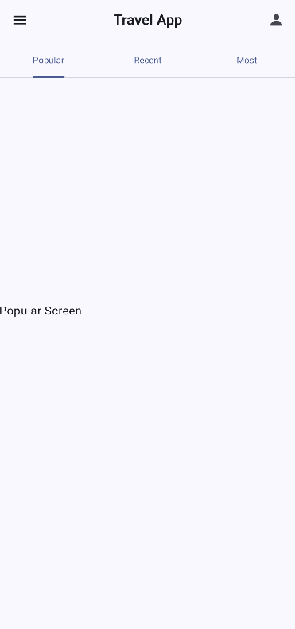
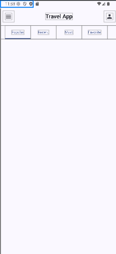
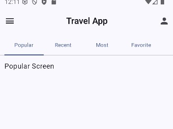

## Scaffold를 활용한 TopAppBar와 BottomBar

Scaffold에는 `topBar`와 `bottomBar` 속성이 있고 해당 속성들은 Composable이다.
이에 대응되는 Composable이 이미 만들어져 있다. 본인이 커스텀하게 만들고 싶어도 무관하나 책에서는 미리 만들어진 Composable을 사용할 것이다.

```kt
@OptIn(ExperimentalMaterial3Api::class)
@Composable
fun Travel() {
    val navController = rememberNavController()
    val baseTab = Tabs.POPULAR
    var selectedTab by remember { mutableIntStateOf(baseTab.ordinal) }

    Scaffold(
        topBar = {

        },
        bottomBar = {

        }
    ) { paddingValues ->

    }
}
```

Scaffold를 만들어주고 필요한 변수들을 만들어준다. `navController`로 내비게이션을 하고, `baseTab`은 화면이 처음 렌더링될 때 어느 화면을 렌더링할 것인지 선택하는 변수이고, `selectedTab`은 현재 어느 탭이 선택됐는지를 알 수 있는 변수이다.

우선 `topBar`부터 작업을 시작해보자.

```kt
topBar = {
    CenterAlignedTopAppBar(
        navigationIcon = {
            IconButton(onClick = {}) {
                Icon(
                    Icons.Default.Menu,
                    contentDescription = "Menu"
                )
            }
        },
        title = {
            Text(
                text = "Travel App",
                style = MaterialTheme.typography.titleLarge,
            )
        },
        actions = {
            IconButton(onClick = {}) {
                Icon(
                    Icons.Default.Person,
                    contentDescription = "Profile"
                )
            }
        }
    )
}
```

`TopAppBar` Composable도 있는데 기본으로 중앙 정렬이 되어 있는 `CenterAlignedTopAppBar` Composable을 사용했다. 실행하고 topBar를 보면 왼쪽에서부터 `navigationIcon`, `title`, `actions` 순서로 보일 것이다. `navigationIcon`은 우리가 흔히 다른 애플리케이션을 사용할 때 메뉴로 쓰는 부분이다.

```kt
Scaffold(
    // skip...
) { paddingValues ->
    PrimaryTabRow(
        selectedTabIndex = selectedTab,
        modifier = Modifier.padding(paddingValues)
    ) {
        Tabs.entries.forEachIndexed { index, tab ->
            Tab(
                selected = selectedTab == index,
                onClick = {
                    navController.navigate(tab.route)
                    selectedTab = index
                },
                text = {
                    Text(
                        text = tab.label,
                        style = MaterialTheme.typography.bodySmall,
                        maxLines = 1,
                        overflow = TextOverflow.Ellipsis
                    )
                }
            )
        }
    }
    AppNavHost(navController, baseTab)
}
```



탭을 눌러보면 화면이 바뀐다.

```kt
public fun PrimaryTabRow(
    selectedTabIndex: Int,
    modifier: Modifier = Modifier,
    containerColor: Color = TabRowDefaults.primaryContainerColor,
    contentColor: Color = TabRowDefaults.primaryContentColor,
    indicator: @Composable (TabIndicatorScope.() -> Unit) = {
        TabRowDefaults.PrimaryIndicator()
    },
    divider: @Composable (() -> Unit) = @Composable { HorizontalDivider() },
    tabs: @Composable (() -> Unit)
): Unit
```

- `selectedTabIndex`: 현재 선택된 탭이 몇 번째인지를 알 수 있는 속성
- `containerColor`: 탭의 배경색
- `contentColor`: 탭의 글자색
- `indicator`: 결과물을 보면 현재 선택된 탭에 밑줄이 보일 것이다. Composable을 커스텀하게 만들어서 지정할 수 있다.
- `divider`: 지금은 탭 간 간격이 멀어서 구분이 되지만 시각적으로 구분하고 싶을 때 쓰는 구분선이다.
- `tabs`: 탭들을 정의하는 곳이다. 이 탭을 눌렀을 때 화면이 변경되게 하면 된다.

```kt
Tabs.entries.forEachIndexed { index, tab ->
    Tab(
        selected = selectedTab == index,
        onClick = {
            navController.navigate(tab.route)
            selectedTab = index
        },
        text = {
            Text(
                text = tab.label,
                style = MaterialTheme.typography.bodySmall,
                maxLines = 1,
                overflow = TextOverflow.Ellipsis
            )
        }
    )
}
```

`onClick`이 우리가 주목해서 봐야 할 부분이다. `navController.navigate()`가 화면을 이동하는 함수이다. 매개변수로 어디로 이동할지 명시해주면 되는데 만약 Popular 탭을 누르면 `navController.navigate("popular")`가 되는 것이다.

그런데 만약 탭 개수를 늘리면 어떻게 될까? `PrimaryTabRow`는 정해진 구역 안에서 균등하게 분할하기 때문에 Tab들의 너비가 줄어든다. 이럴 때는 `ScrollableTabRow`를 쓰면 된다.

> 여기서 잠깐 멈추고 `PrimaryTabRow`를 `ScrollableTabRow`로 변경해봐라.
> 바꾸고 나서 탭 개수를 늘리고 화면들도 만들어봐라. 귀찮거나 잘 모르겠으면 바로 아래 내용을 이어서 보면 된다.

변경한 Tab
```kotlin
ScrollableTabRow(
    edgePadding = 16.dp, // 양옆 여백, 기본값으로 하면 여백이 너무 많음.
    selectedTabIndex = selectedTab,
    modifier = Modifier.padding(paddingValues)
) {
    // skip...
}

enum class Tabs(
    val route: String,
    val label: String,
) {
    // skip...
    FAVORITE("favorite", "Favorite"),
    PICK("pick", "Pick"),
    DUMMY("dummy", "Dummy"),
}

@Composable
fun AppNavHost(
    // skip...
) {
    NavHost(
        // skip...
    ) {
        Tabs.entries.forEach { tab ->
            composable(tab.route) {
                when (tab) {
                    Tabs.POPULAR -> PopularScreen()
                    Tabs.RECENT -> RecentScreen()
                    Tabs.MOST -> MostScreen()
                    Tabs.FAVORITE -> FavoriteScreen()
                    Tabs.PICK -> PickScreen()
                    Tabs.DUMMY -> DummyScreen()
                }
            }
        }
    }
}

// skip...

@Composable
fun FavoriteScreen() {}

@Composable
fun PickScreen() {}

@Composable
fun DummyScreen() {}
```

실행하고 탭에서 안 보이는 부분을 찾아내기 위해 수평 스크롤을 하면 보이지 않던 부분을 클릭할 수 있게 된다.

그리고 또 하나의 문제가 있다.

```kotlin
@Composable
fun PopularScreen() {
    Column(
        modifier = Modifier.fillMaxSize(),
    ) {
        Text(text = "Popular Screen")
    }
}
```

이렇게 변경하고 Popular 탭을 눌러보면 Text 위젯이 보이지 않는다.



파란색 박스가 Text 위젯의 위치이다. 그리고 Column도 시간, 네트워크 상태가 표시된 부분까지 침범하여 위젯을 차지하고 있다. 이 부분을 해결해보자.

```kotlin
// skip...
AppNavHost(navController, baseTab, modifier = Modifier.padding(paddingValues))

@Composable
fun AppNavHost(
    navController: NavHostController,
    startTabs: Tabs,
    modifier: Modifier = Modifier,
) {
    NavHost(
        navController,
        startDestination = startTabs.route,
        modifier = modifier.fillMaxSize(),
    ) {
        // skip...
    }
}

@Composable
fun PopularScreen() {
    Column(
        modifier = Modifier.padding(
            vertical = 60.dp,
            horizontal = 16.dp
        )
    ) {
        Text(text = "Popular Screen")
    }
}
```

`AppNavHost`에 `paddingValues`를 넘겨서 TopAppBar 아래로 화면이 채워지도록 한다. 그리고 `AppNavHost`에 바꿔 끼워질 화면들도 여백을 추가로 줘서 탭이 있는 부분을 침범하지 않도록 한다. 변경하면 다음과 같아진다.



이제 다음 절에서 본격적으로 화면 하나하나를 만들어보자.