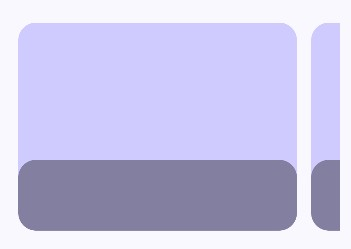

## 영역 나누고 그 영역에 내용물 채우기

UI를 만들 때 영역만 나눠지면 나머지는 내용물만 채우면 되기 때문에
먼저 영역만 잘 잡아주면 그 다음은 쉽다.

```kotlin
fun PopularScreen() {
    Column(
        modifier = Modifier
            .verticalScroll(rememberScrollState())
            .padding(
                top = 80.dp,
                bottom = 0.dp,
                start = 24.dp,
                end = 24.dp
            )
    ){
        Row(
            horizontalArrangement = Arrangement.spacedBy(16.dp),
            modifier = Modifier
                .horizontalScroll(rememberScrollState())
        ){
            
        }
    }
}
```

Column으로 화면 전체를 채워주고 Row에 횡스크롤을 가능하게 해준다.
Row에 횡스크롤을 가능하게 해주면 위젯이 화면 범위를 벗어나도 별다른 이상이
없어진다. 

```kotlin
Row(
    horizontalArrangement = Arrangement.spacedBy(16.dp),
    modifier = Modifier
        .horizontalScroll(rememberScrollState())
){
    repeat(3) {
        Box(
            modifier = Modifier
                .width(315.dp)
                .height(235.dp)
                .clip(
                    RoundedCornerShape(20.dp)
                )
                .graphicsLayer {
                    compositingStrategy = CompositingStrategy.Offscreen
                }
                .background(Color(0xFFD0CBFF))
        ){
            
        }
    }
}
```

> graphicsLayer 모디파이어는 이 장에서 설명하기에는 어려운 내용이므로
지금은 화면을 만드는데 집중한다.

이러면 양 옆으로 스크롤 가능하게 하여 콘텐츠의 크기를 크게 유지하면서
다른 컨텐츠도 볼 수 있는 것이 가능하다.

```kotlin
Box(
    modifier = Modifier
        .width(315.dp)
        .height(235.dp)
        .clip(
            RoundedCornerShape(20.dp)
        )
        .graphicsLayer {
            compositingStrategy = CompositingStrategy.Offscreen
        }
        .background(Color(0xFFD0CBFF))
    ){
    Column(
        modifier = Modifier
            .fillMaxWidth()
            .height(80.dp)
            .clip(RoundedCornerShape(20.dp))
            .drawWithContent {
                drawRect(
                    color = Color(0xFFA0A0A0),
                    blendMode = BlendMode.Multiply
                )
                drawContent()
            }
            .align(Alignment.BottomCenter),
        ){
        
    }
}
```

여기까지 하면 다음과 같은 결과물을 볼 수 있다.



이제 회색박스 내부에 텍스트와 아이콘들을 채워보자

```kotlin
// 텍스트와 하트 아이콘 버튼
Row(
    modifier = Modifier
        .fillMaxWidth()
        .padding(vertical = 8.dp, horizontal = 16.dp),
    horizontalArrangement = Arrangement.SpaceBetween,
){
    Row(
        modifier = Modifier
            .fillMaxWidth()
            .padding(vertical = 8.dp, horizontal = 16.dp),
        horizontalArrangement = Arrangement.SpaceBetween,
    ){
        Text(
            text = "Northern Mountain",
            style = MaterialTheme.typography.titleMedium,
            maxLines = 1,
            color = Color.White
        )
        Box(
            modifier = Modifier
                .size(24.dp)
                .clip(RoundedCornerShape(50.dp))
                .background(Color.White),
            contentAlignment = Alignment.Center,
        ){
            Icon(
                imageVector = Icons.Default.Favorite,
                tint = Color.Red,
                contentDescription = "Like",
                modifier = Modifier.size(14.dp)
            )
        }
    }
}
// 별점 아이콘들과 별점 수치
Row(
    modifier = Modifier.padding(horizontal = 16.dp),
    horizontalArrangement = Arrangement.spacedBy(8.dp)
){
    Row {
        repeat(5) {
            Icon(
                imageVector = Icons.Default.Star,
                tint = Color.Yellow,
                contentDescription = "Star",
                modifier = Modifier.size(16.dp)
            )
        }
    }
    Text(
        text = "4.5",
        style = MaterialTheme.typography.bodySmall,
        maxLines = 1,
        color = Color.White
    )
}
```

이렇게 하면 우선 상단의 컨텐츠는 완성이다. 위의 컴포저블은 앞으로 반복해서
사용할 계획이므로 별도의 컴포넌트로 만들어둔다. 필자는 BannerComponent라고
작명하여 만들었다.

```kotlin
@Composable
fun BannerComponent(){
    Box(
        modifier = Modifier
            .width(315.dp)
            .height(235.dp)
            .clip(
                RoundedCornerShape(20.dp)
            )
            .graphicsLayer {
                compositingStrategy = CompositingStrategy.Offscreen
            }
            .background(Color(0xFFD0CBFF))
    ) {
        Column(
            modifier = Modifier
                .fillMaxWidth()
                .height(80.dp)
                .clip(RoundedCornerShape(20.dp))
                .drawWithContent {
                    drawRect(
                        color = Color(0xFFA0A0A0),
                        blendMode = BlendMode.Multiply
                    )
                    drawContent()
                }
                .align(Alignment.BottomCenter),
        ) {
            Row(
                modifier = Modifier
                    .fillMaxWidth()
                    .padding(vertical = 8.dp, horizontal = 16.dp),
                horizontalArrangement = Arrangement.SpaceBetween,
            ) {
                Text(
                    text = "Northern Mountain",
                    style = MaterialTheme.typography.titleMedium,
                    maxLines = 1,
                    color = Color.White
                )
                Box(
                    modifier = Modifier
                        .size(24.dp)
                        .clip(RoundedCornerShape(50.dp))
                        .background(Color.White),
                    contentAlignment = Alignment.Center,
                ) {
                    Icon(
                        imageVector = Icons.Default.Favorite,
                        tint = Color.Red,
                        contentDescription = "Like",
                        modifier = Modifier.size(14.dp)
                    )
                }
            }
            Row(
                modifier = Modifier.padding(horizontal = 16.dp),
                horizontalArrangement = Arrangement.spacedBy(8.dp)
            ) {
                Row {
                    repeat(5) {
                        Icon(
                            imageVector = Icons.Default.Star,
                            tint = Color.Yellow,
                            contentDescription = "Star",
                            modifier = Modifier.size(16.dp)
                        )
                    }
                }
                Text(
                    text = "4.5",
                    style = MaterialTheme.typography.bodySmall,
                    maxLines = 1,
                    color = Color.White
                )
            }
        }
    }
}
```
중간에 Recommended와 View All 텍스트를 추가하고 바로 하단에 
컨텐츠들을 리스트로 배치해주면 된다.

```kotlin
Row(
    horizontalArrangement = Arrangement.spacedBy(16.dp),
    modifier = Modifier
        .horizontalScroll(rememberScrollState())
) {
    repeat(3) {
        BannerComponent()
    }
}

Spacer(Modifier.height(16.dp))

Row(
    horizontalArrangement = Arrangement.SpaceBetween,
    modifier = Modifier.fillMaxWidth()
) {
    Text(
        text = "Recommended",
        style = MaterialTheme.typography.titleMedium,
        maxLines = 1,
        )
    Text(
        text = "View All",
        style = MaterialTheme.typography.titleMedium,
        maxLines = 1,
        modifier = Modifier
            .clickable(
                onClick = {}
            )
    )
}

Spacer(Modifier.height(16.dp))
```

하단에 리스트를 배치하는 것은 필자는 FlowRow를 사용하겠다.

```kotlin
FlowRow(
    horizontalArrangement = Arrangement.spacedBy(16.dp),
    verticalArrangement = Arrangement.spacedBy(16.dp),
    maxItemsInEachRow = 2,
    modifier = Modifier
        .fillMaxWidth()
){
    repeat(6) {
        BannerComponent()
    }
}
```

그런데 원하는 결과물이 나오지 않는다. 한 행에 2개씩 배치되기를 기대했지만
그렇지 않다. BannerComponent의 너비가 넓어서 그러니 너비를 조절하고
높이도 조절해보자.

```kotlin
@Composable
fun BannerComponent(isLarge: Boolean = true){
    Box(
        modifier = Modifier
            .width(if(isLarge) 315.dp else 170.dp)
            .height(if(isLarge) 250.dp else 170.dp)
            .clip(
                RoundedCornerShape(20.dp)
            )
            .graphicsLayer {
                compositingStrategy = CompositingStrategy.Offscreen
            }
            .background(Color(0xFFD0CBFF))
    ) {
        Column(
            modifier = Modifier
                .fillMaxWidth()
                .height(if(isLarge) 80.dp else 56.dp)
                .clip(RoundedCornerShape(20.dp))
                .drawWithContent {
                    drawRect(
                        color = Color(0xFFA0A0A0),
                        blendMode = BlendMode.Multiply
                    )
                    drawContent()
                }
                .align(Alignment.BottomCenter),
        ) {
            Row(
                modifier = Modifier
                    .fillMaxWidth()
                    .padding(vertical = 8.dp, horizontal = 16.dp),
                horizontalArrangement = Arrangement.SpaceBetween,
            ) {
                Text(
                    text = "Northern Mountain",
                    style = if(isLarge) MaterialTheme.typography.titleLarge
                    else MaterialTheme.typography.titleSmall,
                    maxLines = 1,
                    color = Color.White
                )
                Box(
                    modifier = Modifier
                        .size(if(isLarge) 24.dp else 16.dp)
                        .clip(RoundedCornerShape(50.dp))
                        .background(Color.White),
                    contentAlignment = Alignment.Center,
                ) {
                    Icon(
                        imageVector = Icons.Default.Favorite,
                        tint = Color.Red,
                        contentDescription = "Like",
                        modifier = Modifier.size(if (isLarge) 14.dp else 8.dp)
                    )
                }
            }
            Row(
                modifier = Modifier.padding(horizontal = 16.dp),
                horizontalArrangement = Arrangement.spacedBy(8.dp)
            ) {
                Row {
                    repeat(5) {
                        Icon(
                            imageVector = Icons.Default.Star,
                            tint = Color.Yellow,
                            contentDescription = "Star",
                            modifier = Modifier.size(if(isLarge) 14.dp else 8.dp)
                        )
                    }
                }
                Text(
                    text = "4.5",
                    style = MaterialTheme.typography.bodySmall,
                    maxLines = 1,
                    color = Color.White
                )
            }
        }
    }
}
```

그 후 결과물을 보면 기대한 결과가 나온다.  

이번 절에서는 여기까지하고 다음은 상세페이지를 만들어 보겠다.