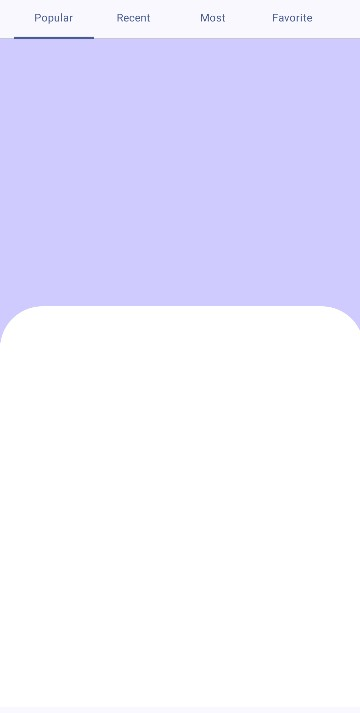
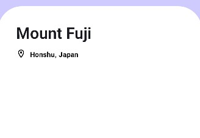
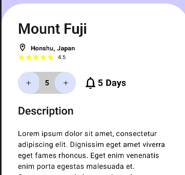
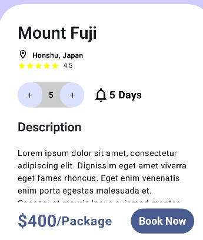

## 이번엔 진짜 페이지 이동하는 것처럼 이동해보자.

리스트의 요소를 누르면 그 여행지에 대해 자세한 내용을 볼 수 있는 화면으로
이동하게 해보자. 참고한 것과 우리가 구현한 결과물이 조금 
다르다는 것을 먼저 알린다.  

우선 Scaffold의 본문 부분을 수정하자.
```kotlin
{ paddingValues ->
        Column(
            modifier = Modifier
                .fillMaxSize()
                .padding(paddingValues)
        ) {
            ScrollableTabRow(
                edgePadding = 16.dp,
                selectedTabIndex = selectedTab,
            ) {
                Tabs.entries.forEachIndexed { index, tab ->
                    Tab(
                        selected = selectedTab == index,
                        onClick = {
                            navController.navigate(tab.route)
                            selectedTab = index
                        },
                        text = {
                            Text(
                                text = tab.label,
                                style = MaterialTheme.typography.bodySmall,
                                maxLines = 1,
                                overflow = TextOverflow.Ellipsis
                            )
                        }
                    )
                }
            }
            AppNavHost(
                navController,
                baseTab,
                modifier = Modifier.weight(1f) // 나머지 공간 채우기
            )
        }
    }
```

아마 이전 장에서 화면을 위 아래로 스크롤하면 화면이 탭 부분을 가릴 것이다.
그 부분을 수정한 것이다. 그 다음에는 AppNavHost를 수정하고 DetailScreen
을 추가한다.

```kotlin
@Composable
fun AppNavHost(
    navController: NavHostController,
    startTabs: Tabs,
    modifier: Modifier = Modifier,
) {
    NavHost(
        navController,
        startDestination = startTabs.route,
        modifier = modifier.fillMaxSize(),
    ) {
        Tabs.entries.forEach { tab ->
            composable(tab.route) {
                when (tab) {
                    Tabs.POPULAR -> PopularScreen(navController)
                    Tabs.RECENT -> RecentScreen()
                    Tabs.MOST -> MostScreen()
                    Tabs.FAVORITE -> FavoriteScreen()
                    Tabs.PICK -> PickScreen()
                    Tabs.DUMMY -> DummyScreen()
                }
            }
        }
        composable("detail") {
            DetailScreen()
        }
    }
}

@Composable
fun DetailScreen(){
    Box(
        modifier = Modifier
            .fillMaxSize()
            .background(Color(0xFFD0CBFF))
    ){

    }
}
```

매개변수로 navController를 넘겨줘서 페이지 이동을 할 수 있게 한다.
그 다음에는 BannerComponent에 clickable 모디파이어를 추가하여
클릭하면 상세 화면으로 넘어가게 한다.
```kotlin
@Composable
fun PopularScreen(navController: NavHostController)

@Composable
fun BannerComponent(isLarge: Boolean = true, navController: NavHostController){
    Box(
        modifier = Modifier
            .width(if(isLarge) 315.dp else 170.dp)
            .height(if(isLarge) 250.dp else 170.dp)
            .clip(
                RoundedCornerShape(20.dp)
            )
            .graphicsLayer {
                compositingStrategy = CompositingStrategy.Offscreen
            }
            .background(Color(0xFFD0CBFF))
            .clickable(
                onClick = {
                    navController.navigate("detail")
                },
            )
    )
```

이렇게 하면 BannerComponent를 누르면 화면이 이동된다.
이제 화면을 만들어보자.

> 아래 내용을 따라서 만들다 보면 텍스트의 크기 때문에 위젯이 무너질 수 있는데
어디를 변경해야 하는 지 한 번 찾아보는 시간을 가져봐라.
내용을 무작정 따라오기만 한 것이 아닌 이해를 잘 하면서 따라 온 사람은 5초만에
어디를 바꿀 지 알 것이다.

```kotlin
@Composable
fun DetailScreen(){
    Box(
        modifier = Modifier
            .fillMaxSize()
            .background(Color(0xFFD0CBFF))
    ){
        Box(
            modifier = Modifier
                .fillMaxWidth()
                .fillMaxHeight(0.6f)
                .clip(
                    RoundedCornerShape(
                        topStart = 48.dp,
                        topEnd = 48.dp,
                    )
                )
                .background(Color.White)
                .align(Alignment.BottomCenter)
        )
    }
}
```



이제 흰 색 부분(Column)에 내용을 채워넣으면 된다.

```kotlin
Box(
    modifier = Modifier
        .fillMaxWidth()
        .fillMaxHeight(0.6f)
        .clip(
            RoundedCornerShape(
                topStart = 48.dp,
                topEnd = 48.dp,
                )
        )
        .background(Color.White)
        .align(Alignment.BottomCenter)
    ){
    Column(
        modifier = Modifier
            .fillMaxSize()
            .verticalScroll(rememberScrollState())
            .padding(
                top = 36.dp,
                bottom = 100.dp,
                start = 36.dp,
                end = 36.dp)
    ){
        Text(
            text = "Mount Fuji",
            style = MaterialTheme.typography.titleLarge,
            maxLines = 1,
        )
    }
}
```

스크롤을 흰 색 바탕 부분에서만 가능하게 한다.

```kotlin
Column(
    modifier = Modifier
        .fillMaxSize()
        .verticalScroll(rememberScrollState())
        .padding(
            top = 36.dp,
            bottom = 100.dp,
            start = 36.dp,
            end = 36.dp)
){
    Text(
        text = "Mount Fuji",
        style = MaterialTheme.typography.titleLarge,
        maxLines = 1,
    )

    Row(
        horizontalArrangement = Arrangement.spacedBy(8.dp)
    ){
        Icon(
            imageVector = Icons.Outlined.LocationOn,
            contentDescription = "Location",
            tint = Color.Black,
            modifier = Modifier.size(20.dp)
        )
        Text(
            text = "Honshu, Japan",
            fontSize = 14.sp,
            color = Color.Black,
            fontWeight = FontWeight.Bold,
        )
    }
}
```



이후에 채워질 컨텐츠들은 계속해서 Row로 묶어서 만들어주면 된다.

```kotlin
// ...skip
Row {
    repeat(5) {
        Icon(
            imageVector = Icons.Default.Star,
            tint = Color.Yellow,
            contentDescription = "Star",
            modifier = Modifier.size(16.dp)
        )
    }
    Spacer(modifier = Modifier.width(8.dp))
    Text(
        text = "4.5",
        style = MaterialTheme.typography.bodySmall,
        maxLines = 1,
        color = Color.Black
    )
}
Spacer(modifier = Modifier.height(24.dp))
Row(
    horizontalArrangement = Arrangement.spacedBy(16.dp),
    verticalAlignment = Alignment.CenterVertically,
){
    Row(
        horizontalArrangement = Arrangement.SpaceAround,
        verticalAlignment = Alignment.CenterVertically,
        modifier = Modifier
            .width(128.dp)
            .height(48.dp)
            .clip(RoundedCornerShape(50.dp))
            .background(Color.LightGray)
        ,
    ){
        IconButton(onClick = {},
            modifier = Modifier
                .offset(x = -(5).dp)
                .clip(RoundedCornerShape(40))
                .background(MaterialTheme.colorScheme.primaryContainer)
        ){
            Icon(
                imageVector = Icons.Default.Add,
                contentDescription = "Add",
                modifier = Modifier.size(16.dp)
            )
        }
        Text(
            text = "5",
            fontSize = 16.sp,
            color = Color.Black,
            fontWeight = FontWeight.Bold,
            textAlign = TextAlign.Center,
        )
        IconButton(onClick = {},
            modifier = Modifier
                .offset(x = 5.dp)
                .clip(RoundedCornerShape(50))
                .background(MaterialTheme.colorScheme.primaryContainer)
        ){
            Icon(
                imageVector = Icons.Default.Add,
                contentDescription = "Add",
                modifier = Modifier.size(16.dp)
            )
        }
    }

    Row(
        horizontalArrangement = Arrangement.SpaceAround,
        verticalAlignment = Alignment.CenterVertically,
    ){
        Icon(
            imageVector = Icons.Outlined.Notifications,
            contentDescription = "Notification",
            tint = Color.Black,
            modifier = Modifier.size(32.dp)
        )
        Text(text = "5 Days",
            fontSize = 20.sp,
            color = Color.Black,
            fontWeight = FontWeight.Bold,)
    }
}
Spacer(modifier = Modifier.height(24.dp))
Text(
    text = "Description",
    style = MaterialTheme.typography.titleMedium,
)
Spacer(modifier = Modifier.height(24.dp))
Text(
    text = "Lorem ipsum dolor sit amet, consectetur adipiscing elit." +
            " Dignissim eget amet viverra eget fames rhoncus." +
            " Eget enim venenatis enim porta egestas malesuada et." +
            " Consequat mauris lacus euismod montes." +
            " Consequat mauris lacus euismod montes." +
            " Consequat mauris lacus euismod montes." +
            "Lorem ipsum dolor sit amet, consectetur adipiscing elit." +
            " Dignissim eget amet viverra eget fames rhoncus." +
            " Eget enim venenatis enim porta egestas malesuada et." +
            " Consequat mauris lacus euismod montes." +
            " Consequat mauris lacus euismod montes." +
            " Consequat mauris lacus euismod montes.",
    fontSize = 16.sp,
    color = Color.Black,
    fontWeight = FontWeight.Normal,
)
```



여기서 마지막 콘텐츠를 추가 해야 하는데 두 가지 방식을 고려 해볼 수 있다.  
첫 번째는 Column 내부에 배치하는 방법이다.  
두 번째는 Column 외부에 배치하고 화면 하단에 고정을 하는 방법이다.

필자는 두 번째를 선택 했는데 그 이유는 텍스트의 길이가 길어질 경우 스크롤을
굉장히 많이 해야 한다. 근데 상세 설명을 다 읽지 않고 바로 버튼을 누르고 싶은
사람들이 있을 것이다. 그래서 설명을 다 읽고 싶은 사람에게는 스크롤하게 하고
아니면 바로 버튼을 누를 수 있게 해주는 것이 좋다.

```kotlin
@Composable
fun DetailScreen(){
    Box(
        modifier = Modifier
            .fillMaxSize()
            .background(Color(0xFFD0CBFF))
    ){
        Box(
            modifier = Modifier
                .fillMaxWidth()
                .fillMaxHeight(0.6f)
                .clip(
                    RoundedCornerShape(
                        topStart = 48.dp,
                        topEnd = 48.dp,
                    )
                )
                .background(Color.White)
                .align(Alignment.BottomCenter)
        ){
            Column(){
                // ...skip
            }
            Row(
                modifier = Modifier
                    .fillMaxWidth()
                    .align(Alignment.BottomCenter)
                    .background(Color.White)
                    .padding(
                        vertical = 12.dp,
                        horizontal = 36.dp),
                verticalAlignment = Alignment.CenterVertically,
            ){
                Text(
                    text = "$400",
                    fontSize = 32.sp,
                    color = MaterialTheme.colorScheme.primary,
                    fontWeight = FontWeight.Bold,
                )
                Text(
                    text = "/Package",
                    fontSize = 24.sp,
                    color = MaterialTheme.colorScheme.primary,
                    fontWeight = FontWeight.Bold,
                )
                Spacer(modifier = Modifier.width(36.dp))
                TextButton(onClick = {},
                    modifier = Modifier
                        .width(200.dp)
                        .clip(RoundedCornerShape(50))
                        .background(MaterialTheme.colorScheme.primary)
                ) {
                    Text(
                        text = "Book Now",
                        fontSize = 20.sp,
                        fontWeight = FontWeight.Bold,
                        color = Color.White
                    )
                }
            }
        }
    }
}
```



이것으로 이번 장을 마친다.