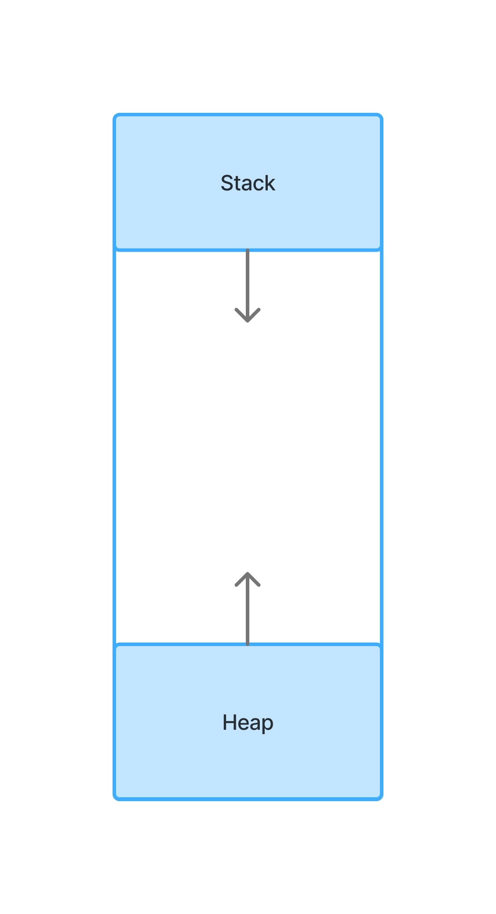

## 코틀린의 기본 문법

[1. 변수](#section-1)  
[2. 타입](#section-2)  
[3. 연산자](#section-3)  
[4. 원시타입과 참조타입](#section-4)

* * *

### <span id="section-1">1. 변수</span>

변수라는 것은 프로그램에서 사용할 데이터를 담는 공간이다.
계속 사용할 데이터는 어딘가에 저장해두고 저장공간에서 꺼내 쓰면
되는 방식인데 다음과 같이 사용하면 된다.

```kotlin
fun main() {
    val x: Int = 1
}
```

위 예시는 변수를 '선언'함과 동시에 '초기화'를 한 것이다.

- 선언: 데이터를 저장할 공간을 만든다.
- 초기회: 데이터를 저장할 공간에 데이터를 저장한다.

위 예시를 일반화 하면 다음과 같다.

(수정 가능 여부) (변수 이름): (변수 타입) = (저장할 데이터)

- val: 수정 가능 여부
- x: 변수 이름
- Int: 변수의 타입
- = : 연산자

코틀린은 val과 var라는 키워드로 수정 가능 여부를 지정한다.

- val: 읽기 전용
- var: 읽고 쓰기(수정) 가능

그래서 다음과 같은 코드는 에러가 난다.

```kotlin
fun main() {
    val x: Int = 1
    x = 2
    print(x)
}
```

x를 수정하고 싶으면 var로 수정하면 된다.
그리고 var는 선언과 동시에 초기화 할 필요 없다.

```kotlin
fun main() {
    var x: Int
    x = 1
    println(x)
    x = 2
    println(x)
}
```

'그럼 전부 다 var로 쓰면 되는 거 아닌가? 그러면 편하잖아.'
라는 생각을 할 수 있는데, 프로그램 개발 도중에 수정이 절대로
되지 않았으면 하는 데이터가 있다는 가정을 하자.
그런데 개발자의 실수 또는 뜻밖의 버그로 인해 데이터가 수정될 수도
있다. 이럴 때를 대비하여 val 키워드로 수정이 불가능하게 제한해두면
실수와 버그를 모두 방지할 수 있다.

### <span id="section-2">2. 타입</span>

변수에는 타입이라는 것이 있다. 타입은 쉽게 이해하면 형태라고
생각하면 된다. 프로그래밍 언어들은 보통 다음과 같은 타입들이
공통적으로 존재한다.

- 숫자
- 논리(참, 거짓)
- 문자
- 문자열
- 사용자 정의
- 이외 기타 등등

타입을 이해하기 위해서는 비트(bit)라는 것을 이해 해야 하는데
비트라는 것은 컴퓨터가 다룰 수 있는 가장 작은 데이터 단위이다.
컴퓨터는 0과 1만 이해하는 기계인데 하나의 비트에는 0 또는 1만 표기된다.
0과 1로만 표현하는 수를 이진수라고 하는데 데이터 크기를 표현하는데
이진수를 많이 사용한다. 그리고 8bit를 1byte로 표기하는데
바이트(byte)도 자주 볼 수 있으니 알아두면 좋다.

```
0           // 1비트
01          // 2비트
0001        // 4비트
00000001    // 8비트(1바이트)
```

비트는 연속적으로 표현되며, 8개가 연속적으로 표현되면 1byte다.

코틀린은 타입을 다음과 같이 제공한다.

**정수 타입**

| 타입    | 크기(비트) | 값의 범위                        |
|-------|--------|------------------------------|
| Byte  | 8      | -128 ~ 127                   |
| Short | 16     | -32768 ~ 32767               |
| Int   | 32     | $$-2^{31}$$ ~ $$2^{31} - 1$$ |
| Long  | 64     | $$-2^{63}$$ ~ $$2^{63} - 1$$ |

**실수 타입**

| 타입     | 크기(비트) | 
|--------|--------|
| Float  | 32     | 
| Double | 64     |

**논리 타입**

```kotlin
val trueValue: Boolean = true
val falseValue: Boolean = false
```

**문자 타입, 문자열 타입**

```kotlin
val oneChar: Char = 'a'
val str: String = "Strings"
```

문자를 여러개 이어 붙인 것이 문자열이다.
문자는 하나의 문자만 저장할 수 있고 빈 문자('')은 저장하지 못한다.

**배열**

배열은 같은 타입의 데이터를 여러개 모아놓은 것이라고 이해하면 된다.
위에 나온 타입들의 데이터들을 하나의 변수에 모아놓고 싶다면 다음과 같이
사용하면 된다.

```kotlin
val arr: Array<Int> = arrayOf(1, 2, 3, 4, 5)
```
배열에 있는 데이터를 꺼내서 사용하는 방법은 연산자 섹션과
제어 흐름절에서 더 학습하겠다.

**null**

null은 타입이 아니고 값이다. null은 값이 없음을 나타내는데
코틀린에서는 기본적으로 null을 허용하지 않는다. 하지만 null을
허용할 수 있는 방법이 있고 이를 'nullable하다' 라고 한다.
위에서처럼 타입을 선언하면 non-null(null 허용 안함)인데
nullable하는 방법은 다음과 같다.

```kotlin
val str1: String = "str"      // non-null
val str2: String? = null      // nullable
```

한 가지 차이점을 확인할 수 있는데 str2에서 타입을 선언할 때
?이 붙는다. ?가 붙으면 null허용 한다는 의미다.

코틀린의 모든 타입은 Any?라는 타입에서 시작된다. 
그리고 non-null타입의 Any가 그 다음이다.
Number, String, Boolean, Char 등이 Any를 상속받았다.

Unit이란 타입도 있는데 아무런 값도 반환하지 않는 함수의 반환
타입이다.

Nothing은 함수가 정상적으로 끝나지 않았을 때 이를 알리는
반환 타입이다.


### <span id="section-3">3. 연산자</span>

```kotlin
fun main() {
    var x: Int = 1
    println(x)
    x += 1 // x = x + 1
    println(x)
}
```

프로그래밍 언어에는 연산자라는 것이 있는데 위 예시코드에서
'=' 과 '+=' 같은 것들이다. 코틀린에서는 연산자가 다음과 같이
주어진다.

| 연산자                | 설명          | 예시                    |
|--------------------|-------------|-----------------------|
| +, -, *, /, %      | 산술 연산       | a + b, a - b          |
| =                  | 대입 연산       | a = 1                 |
| +=, -=, *=, /=, %= | 복합 대입 연산    | a += 1(a = a + 1)     |
| ++, --             | 증감연산        | ++a, a++              |
| &&, II, !          | 논리연산        | a > 0 && a < 10       |
| ==, !=             | 값 비교        | a == b                |
| ===, !==           | 참조 비교       | a === b               |
| <, <=, >, >=       | 크기 비교       | a > b                 |
| []                 | 인덱스 접근      | list[1]               |
| !!                 | non-null 단언 | a!!                   |
| ?.                 | null안전 호출   | a?.length             |
| ?:                 | 엘비스 연산자     | a ?: "기본값"            |
| ::                 | 함수/프로퍼티 참조  | ::println, User::name |
| .., ..<            | 범위 생성       | 1..5, 1..<5           |
| :                  | 타입 선언/상속    | a: Int                |
| ?                  | nullable 선언 | val a: Int?           |
| $                  | 문자열 템플릿     | "숫자: $a"              |

- 논리연산: &&는 And(그리고) ||는 Or(또는), !는 반전연산
- 값 비교, 참조 비교: 값 비교는 변수에 들어있는 값이 같은 것인지 비교하는 것이고
참조 비교는 참조가 같은지 비교하는 것인데 이는 아직 배우지 않은 내용이다.
- 인덱스 접근: array[0]과 같이 사용하면 배열의 첫 번째 요소에
접근 가능하다.
- non-null 단언: nullable 타입 변수에 대해서 프로그램 흐름
특정 시점에서 null이 아니어야 하는 시점이 분명 있어야 한다는
가정을 두자. 그럴 때 a!!을 쓰면 a는 널이 아니다 라고 단언한다.
- null 안전 호출: 안전 호출이라는 것이 무슨 의미냐면 nullable에
대해서 null이 아니면 a의 length를 호출하는 것이다. null이라면
length를 호출하지 않는다.
- 엘비스 연산자:
```kotlin
fun main() {
    var x: Int? = null
    x ?: println("null값임")
    x = 2
    x ?: println("null값임")
}
```
위 예시처럼 변수가 null이면 실행하고 null아니면 실행하지 않는다.

- 함수/프로퍼티 참조:
```kotlin
fun main() {
    val arr = arrayOf(1, 2, 3)
    arr.forEach(::println)
}
```

- 범위 생성:
```kotlin
fun main() {
    for (num in 1..5){
        println(num)
    }
}
```

- 문자열 템플릿: 예시로 숫자 타입을 문자열에서 출력하고 싶은 경우 다음과 같이 사용한다.
```kotlin
fun main() {
    for (num in 1..5){
        println("${num}")
    }
}
```

### <span id="section-4">4. 원시타입과 참조타입</span>

우리가 변수를 선언하면 컴퓨터 메모리에 데이터가 저장되는데 저장이 어떻게 되는 지를
알아둘 필요가 있다. 

우리가 보통 변수를 선언하면 스택이라는 메모리 공간과 힙이라는 메모리 공간에 저장이 되는데
원시타입의 경우에는 스택에 값이 직접 저장되고 참조타입의 경우에는 값이 힙에 저장되고 힙의 위치가
스택에 저장된다.

아래는 스택과 힙이 메모리 영역을 차지하는 방식이다.


다른 프로그래밍 언어라면 몰라도 코틀린에서는 원시타입과 참조타입을 프로그래머가 구분하지 않는다.
컴파일러가 알아서 최적화를 해주기 때문이다. 프로그래머가 의도한 대로 최적화를 하기 위해서는
타입을 명시하면서 개발하는 것이 좋다. 코틀린은 자바의 타입을 그대로 사용하는 경우가 많으며,
경우에 따라 컴파일할 때 자바의 원시타입, 참조타입으로 변환된다.

```kotlin
val num1: Int = 1   // Java의 int
val num2: Int? = 1  // Java의 Integer
```

저 둘은 데이터 수가 많은 배열인 경우에 성능 차이가 확연하게 벌어진다. Java의 Integer같은 타입을
Wrapper타입이라고 하는데 Wrapper는 포장지가 하나 씌워진 거라고 생각하면 된다.  

만약 Integer배열의 길이가 10000인 경우 반복문을 실행하면 값을 확인하기 위해 포장지를 뜯고 내용물을
확인하고 다시 포장을 해야 한다. 하지만 int배열인 경우 그냥 값만 확인하면 된다.

만약 성능을 끌어올려야 하는 상황이 오면 이런 사소한 경우를 체크하여 조금이라도 최적화를 할 수 있다.