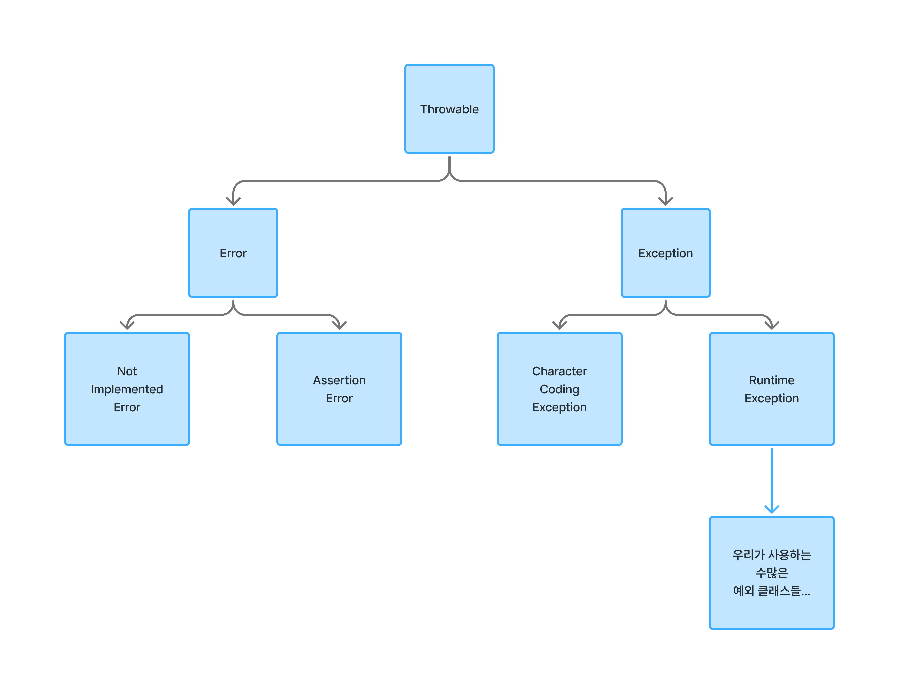

## 코틀린의 예외처리

[1. 예외](#1-예외)
[2. 예외처리](#2-예외처리)
[3. 예외클래스](#3-예외클래스)

* * *

### 1. 예외

프로그램이 실행되고 있는 중에 어떤 이유인지 모를 에러가 발생할 수 있다.
우리가 프로그램을 만들고 실행했을 때 에러가 나면 프로그램이 완전히 실행되지
않고 중단되고 종료된다. 우리는 우리의 프로그램이 실행 도중에 생각하지도
못한 에러가 날 거라는 것을 가정하고 그에 대한 대응을 해야 한다.
생각하지도 못한 에러를 `예외`라 한다. 그리고 프로그램이 실행 도중에
`예외`가 발생해도 프로그램이 종료되지 않고 계속해서 실행이 되게 하는
조치를 `예외처리`라고 한다.

프로그래밍에서 예외는 생각하지 못한 부분에서 발생할 수도 있지만
프로그래머가 예외를 일부러 발생시킬 수도 있다. 이러한 것을 **예외를 던진다**고 표현한다.

예외처리에서 자주 볼 수 있는 키워드들이다.

1. Throw: 직역 그대로 던진다.
2. Exception: 직역 그대로 예외.
3. Catch: 예외를 잡아내기.
4. Finally: 예외처리 후 마지막에 할 작업.

### 2. 예외처리

고전적인 예외처리는 다음과 같다.

```kotlin
/*
* 숫자는 무조건 자연수여야 한다.
* 자연수가 아니라면 강제로 1을 대입한다.
* */
var num: Int = 0
if (num <= 0) {
    num = 1
}
print(num)
```

조건문으로 발생할 수 있는 예외에 대한 처리를 해야 했다.

C++, Java, C#, Swift, Kotlin 등의 프로그래밍 언어들은 다음과 같이
예외처리를 할 수 있게 한다.

```kotlin
try {
    // Throw Exception
} catch (Error Type) {
    // Error Handling
} catch (Error Type) {
    // Error Handling
} finally {
    // Final Action
}
```

1. `try` 블록 내부에 예외가 발생할 수 있는 구문을 작성한다.
2. `catch`의 소괄호 내부에 처리할 예외 종류를 기재한다. 해당 종류의 예외를 `catch` 블록 내부에서 처리한다.
3. `catch` 블록은 여러 개 작성 가능하다. 여러 가지의 예외에 대응하기 위해서이다.
4. `finally` 블록에서는 마지막에 처리할 작업을 작성한다. 예외가 발생하든 안 하든 무조건 실행되는 블록이다. `finally`는 필수적으로 사용할 필요 없고 `try-catch`만 사용해도 무관하다.

다음의 시나리오를 가지고 예외처리를 학습해보자.

1. 숫자를 입력받는다.
2. 입력을 받았는데 숫자가 아닌 경우 예외를 던진다.
3. 예외가 발생하면 숫자가 아니라는 메시지를 출력한다.
4. 에러가 발생하든 안 하든 마지막에는 무조건 메시지를 출력한다.

```kotlin
fun main() {
    try {
        val num: Int = readln().toInt() // 1, 2
        println(num)
    } catch (e: Exception) {
        println("숫자가 아님")            // 3
    } finally {
        println("입력 받기 완료!")        // 4
    }
}

/* 숫자를 입력한 경우
입력: 123
123
입력 받기 완료!
*/

/* 문자를 입력한 경우
입력: 코틀린
숫자가 아님
입력 받기 완료!
*/
```

숫자를 입력해보기도 하고 한글이나 알파벳을 입력해보기도 하면
결과를 알 수 있다. `finally` 블록을 제외하고 실행해도 문제가 없음을
알 수 있다.

Kotlin이나 Rust 같은 언어에서는 다음과 같은 형태로 예외처리를 간편하게
할 수 있다.

```kotlin
val sampleList = listOf(1, 2, 3)
val value = sampleList.getOrNull(3)
println("value = $value")
```

```rust
let f = std::fs::File::open("file.txt").unwrap_or_else(|e| {
    panic!("에러 발생: {:?}", e);
});
```

코틀린 예시에서는 예외가 발생한 경우 바로 null을 대입해서 처리한다.

`try-catch` 방식과 `orNull()` 형태의 함수 방식의 차이점은
어떤 예외가 발생할지 단정 지을 수 있느냐 없느냐의 차이다.
다음 절에서 설명할 예정인데 예외에는 여러 종류가 있다.
`try-catch` 방식의 경우에는 `Exception`이라는 클래스로 범용성 있게
처리할 수 있다. 그리고 어디서 어떤 예외가 발생했는지 확인할 때는
`try-catch` 방식이 더 좋다. `orNull()`의 경우에는 null만 대입하고
끝이다. 그래서 간단한 경우에만 `orNull()` 함수로 처리하는 게 좋다.

어떤 예외가 발생했는지 구체적으로 알아낼 수 있는 방법은 아래와 같다.

```kotlin
fun main() {
    try {
        val num: Int = readln().toInt()
        println(num)
    } catch (e: Exception) {
        e.printStackTrace()
    } finally {
        println("입력 받기 완료!")
    }
}

/*
java.lang.NumberFormatException: For input string: "rrr"
    at java.base/java.lang.NumberFormatException.forInputString(NumberFormatException.java:67)
    at java.base/java.lang.Integer.parseInt(Integer.java:668)
    at java.base/java.lang.Integer.parseInt(Integer.java:786)
    at MainKt.main(Main.kt:3)
    at MainKt.main(Main.kt)
*/
```

`printStackTrace()`를 호출하면 어떤 에러가 발생했는지 알 수 있다.
위 예시에서는 `NumberFormatException`이 발생한 것을 볼 수 있다.

### 3. 예외클래스



`Throwable` 클래스를 상속받는 두 클래스가 있다. `Error`와 `Exception`이
있는데 우리는 지금 `Exception` 타입에 집중할 것이다.

`Exception` 타입은 다시 `CharacterCodingException`과
`RuntimeException`으로 상속이 된다. 그리고 프로그래머가 예외를 처리할 때
자주 쓰는 예외 타입들은 `RuntimeException` 타입을 상속한 예외 클래스이다.

다음은 `RuntimeException`을 상속받는 예외 타입들의 예시이다.

```kotlin
fun main() {
    try {
        val sampleNum = 1 / 0               // ArithmeticException
        val sampleList = listOf(1, 2, 3)
        val sampleIndex = sampleList.get(3) // IndexOutOfBoundsException
    } catch (e: ArithmeticException) {
        println("잘못된 산술 연산")
    } catch (e: IndexOutOfBoundsException) {
        println("잘못된 인덱스 접근")
    }
}
```

위 예시는 1을 0으로 나누는 경우와 존재하지 않는 인덱스에 접근하는 경우이다.
실행해보면 "잘못된 인덱스 접근"은 보지 못하는데 1을 0으로 나누는 연산을
하면 예외가 발생하기 때문에 바로 `ArithmeticException` catch 블록으로
이동한다. `IndexOutOfBoundsException` catch 블록을 실행해보고 싶다면 `sampleNum`에
대입되는 나눗셈 연산을 0이 아닌 다른 정수로 바꾸면 다음 라인을 실행하니
확인해보고 싶다면 시도해봐라.