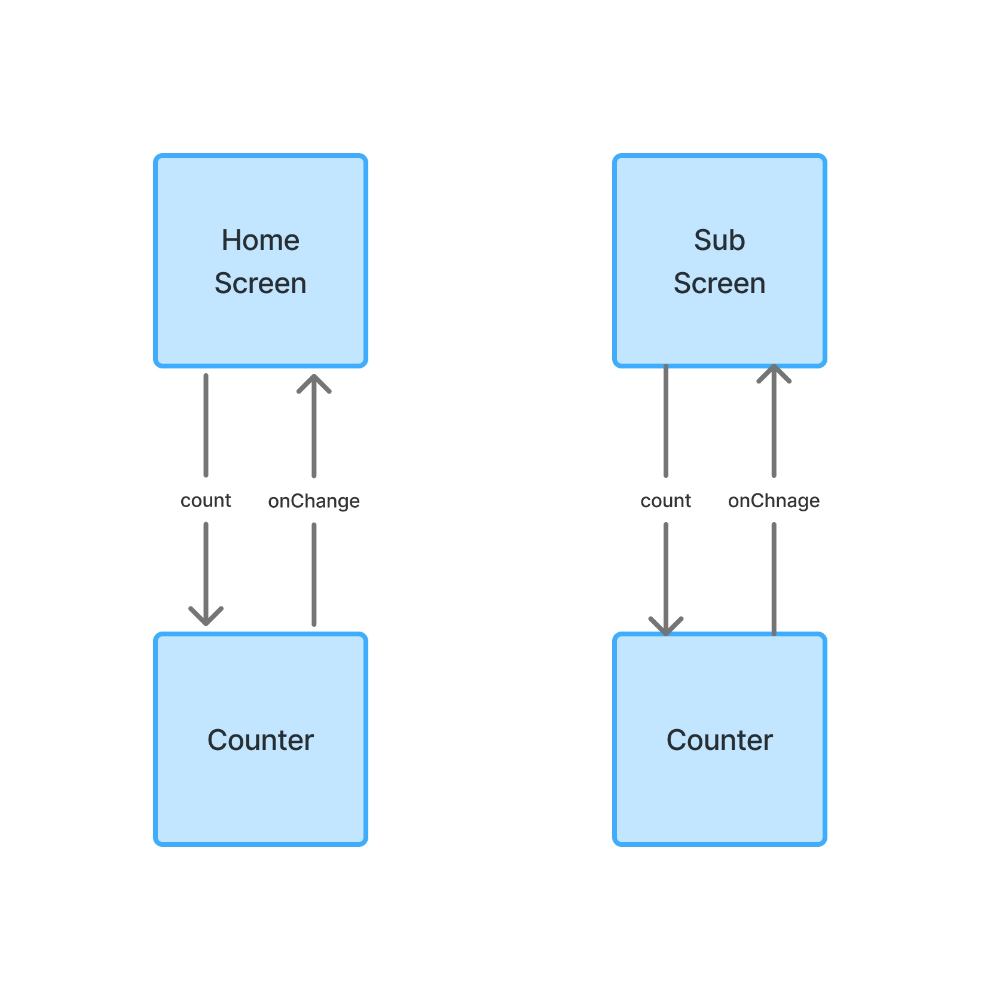

## 상태는 위에서 아래로만 흐른다.

[1. 상태란 무엇인가](#section-1)  
[2. 상태와 이벤트??](#section-2)  
[3. 상태와 이벤트의 흐름 예시](#section-3)

* * *
### <span id="section-1">1. 상태란 무엇인가</span>

상태는 크게 두 가지 분류로 나뉜다.
1. 화면 UI 상태
2. UI 요소 상태

1번은 화면에 사용자의 나이 27세를 표기한다면 27이 상태이다
2번은 화면을 위아래로 스크롤 할지 양옆으로 스크롤 할지 결정하는 것이다.
개념이 어렵다면 일단 변수라고만 이해해도 된다.

상태 관리를 하고 싶다면 다음과 같은 형태의 변수를 초기화 하면 된다.

```kotlin
var count: Int by remember { mutableIntStateOf(0) } // 읽고 쓰기 가능
val count: Int by remember { mutableIntStateOf(0) } // 읽기만 가능
```

### <span id="section-2">2. 상태와 이벤트??</span>

상태가 있고 이벤트가 있는데 Compose에서 이벤트는 상태를 변경하는 것이다.
Compose는 단방향 데이터 흐름(UDF) 패턴을 권고하는데 상태는 아래로만,
이벤트는 위로만 전달한다. 그리고 Compose에서 UDF를 실현하는 방법이 있는데
상태 호이스팅이라는 것이다. 상태가 보여질 컴포저블에서 상태를 직접 수정하는 것이 아닌
상태를 수정할 이벤트를 상태와 같이 내려보내고 이벤트가 발생하면 상태 변화가 반영이 된다.

이러한 패턴을 적용하는 이유는 상태를 어디에서든지 자유롭게 사용하기 위해서이다.

### <span id="section-3">3. 상태와 이벤트의 흐름 예시</span>

새로운 Compose 프로젝트를 만들고 다음과 같이 작업한다.

MainScreen.kt
```kotlin
fun NavHostController.handleNavigation(route: String) {
    when(route){
        "home" -> navigate("home")
        "sub" -> navigate("sub")
        else -> popBackStack()
    }
}

@Composable
fun MainScreen(){
    val navController = rememberNavController()
    NavHost(
        modifier = Modifier
            .safeContentPadding()
            .fillMaxSize(),
        navController = navController,
        startDestination = "home") {
        composable("home") {
            HomeScreen(
                navController::handleNavigation
            )
        }
        composable("sub") {
            SubScreen(
                navController::handleNavigation
            )
        }
    }
}

@Composable
fun Counter(count: Int, onChange: () -> Unit) {
    Text(
        text = "$count",
        modifier = Modifier
            .clickable(
                onClick = onChange,
            )
    )
}
```

HomeScreen.kt
```kotlin
@Composable
fun HomeScreen(
    onNavigate: (String) -> Unit = {},
) {
    var count: Int by remember { mutableIntStateOf(0) }
    Column (
        horizontalAlignment = Alignment.CenterHorizontally,
        verticalArrangement = Arrangement.Center,
        modifier = Modifier.fillMaxSize()
    ){
        Counter(
            count = count,
            onChange = { count++ }
        )
        Text(
            text = "Home Screen",
        )
        Button(onClick = {
            onNavigate("sub")
        }) {
            Text(text = "Go SubScreen")
        }
    }
}
```

SubScreen.kt
```kotlin
@Composable
fun SubScreen(
    onNavigate: (String) -> Unit = {},
){
    var count: Int by remember { mutableIntStateOf(0) }
    Column (
        horizontalAlignment = Alignment.CenterHorizontally,
        verticalArrangement = Arrangement.Center,
        modifier = Modifier.fillMaxSize()
    ){
        Counter(
            count = count,
            onChange = { count++ }
        )
        Text(
            text = "Sub Screen",
        )
        Button(onClick = {
            onNavigate("home")
        }) {
            Text(text = "Go HomeScreen")
        }
    }
}
```

MainActivity.kt
```kotlin
class MainActivity : ComponentActivity() {
    override fun onCreate(savedInstanceState: Bundle?) {
        super.onCreate(savedInstanceState)
        enableEdgeToEdge()
        setContent {
            WikiappTheme {
                MainScreen()
            }
        }
    }
}
```

위 Compose앱에서 count 상태의 흐름은 다음과 같다.



Counter 컴포저블에 매개변수로 count와 onChange를 같이 내려보냈다.
Counter 컴포저블은 count를 보여주고 있고 버튼 클릭시 onChange 이벤트가 발생되게 하여
상태를 업데이트 하고 있다.

#### 스테이트풀(Stateful)과 스테이트리스(Stateless)
- Stateful: 상태를 가지고 있다는 것을 의미한다.
- Stateless: 상태를 가지고 있지 않다는 것을 의미한다.

Stateful은 위 예시에서 HomeScreen이나 SubScreen같이 상태를 직접 가지고 있는 것을 의미한다.
Stateless는 Counter처럼 상태와 이벤트를 외부에서 주입받는 것을 의미한다.

이러한 구조가 상태 호이스팅(State Hoisting)의 예시다.

이러한 예시가 하나 더 있는데 위 코드에서 네비게이션을 처리할 때 볼 수 있다.


```kotlin
fun NavHostController.handleNavigation(route: String) {
    when(route){
        "home" -> navigate("home")
        "sub" -> navigate("sub")
        else -> popBackStack()
    }
}

@Composable
fun MainScreen(){
    val navController = rememberNavController()
    NavHost(
        modifier = Modifier
            .safeContentPadding()
            .fillMaxSize(),
        navController = navController,
        startDestination = "home") {
        composable("home") {
            HomeScreen(
                navController::handleNavigation
            )
        }
        composable("sub") {
            SubScreen(
                navController::handleNavigation
            )
        }
    }
}

@Composable
fun HomeScreen(onNavigate: (String) -> Unit = {}, )
@Composable
fun SubScreen(onNavigate: (String) -> Unit = {}, )
```

화면을 이동하기 위한 navController를 MainScreen만 가지고 있고 화면을 이동하는 이벤트만
전달하여 처리하고 있다. 컴포저블이 몇 번 중첩될 지 모르는 상황에서 계속해서 navController를
전달하게 될 경우, 3, 4단계 깊이까지 계속 전달하게 될 수도 있다. 하지만 이벤트만 전달하면 이렇게
간단해진다.