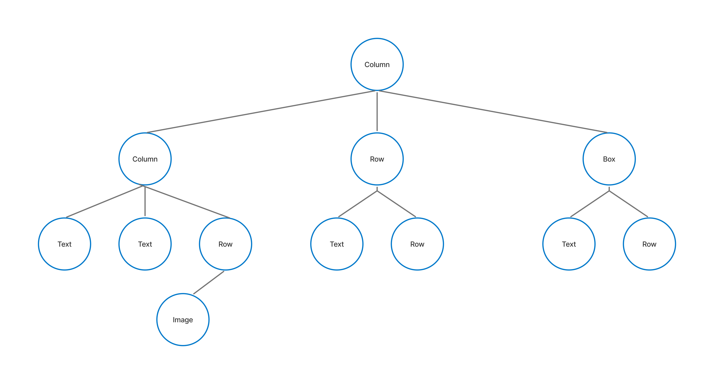

# 렌더링은 3단계 과정을 거친다

[1. 프레임의 세 단계](#section-1)  
[2. 상태 읽기](#section-2)

* * *
### <span id="section-1">1. 프레임의 세 단계</span>

프레임의 세 단계라고 되어 있는데 여기서 프레임은 동영상의 한 프레임을 말할 때 그 프레임과 동일하다고
생각하면 된다. 한 프레임은 보통 출력 기기마다 다르며, 요즘 스마트폰 기준으로는 30~60fps로 만드는 게 좋다.
Compose는 세 단계를 통해 렌더링을 한다.

1. 컴포지션: 표시할 UI, 컴포저블이 실행되고 구성된 UI 트리
2. 레이아웃: UI를 배치할 위치, 측정과 배치라는 것을 하는데 컴포지션(UI 트리)를 보고 2D 좌표로 측정하고 배치한다.
3. 그리기: UI를 렌더링 하는 방법, 기기 화면인 캔버스에 그려진다.

UI를 업데이트 한다는 것은 UI 트리를 다시 배치 한다는 의미인데 Compose는 필요한 부분만 다시
배치하고 불필요하게 전부 재배치 하지 않는다. Compose가 상태를 추적하기 때문에 가능하다.


#### 컴포지션

컴포지션 단계에서는 컴포저블을 실행하고 UI 트리를 만든다.

```kotlin
Column{
    Column{
        Text()
        Text()
        Row{
            Image
        }
    }
    Row{
        Image()
        Text()
    }
    Box{
        Image()
        Image()
    }
}
```



컴포지션단계에서 그림과 같이 UI트리가 구성된다.


#### 레이아웃

컴포지션을 입력으로 받아서 각각의 컴포저블들의 크기와 위치를 결정한다.
레이아웃 단계에서 3단계로 UI트리를 순회한다.

1. 하위 요소 측정: 컴포저블의 하위 요소를 측정
2. 자체 크기 결정: 측정한 값을 기반으로 컴포저블의 자체 크기를 결정
3. 하위 요소 배치: 자체 위치를 기준으로 하위 컴포저블을 배치

위 3단계가 끝나면 별도의 레이아웃 트리가 만들어진다. 형태는 똑같지만 몇 가지 정보가
추가된 트리이다. 각 노드(컴포저블)별로 할당된 너비, 높이와 위치 좌표(x, y)가 있다.


#### 그리기

그리기 단계에서는 레이아웃 트리를 위에서 아래로 순회하여 노드가 화면에 차례로 그려진다.

Compose는 위 세 단계를 절차적이면서도 독립을 유지한다. 리컴포지션의 경우
상태가 변경되면 UI트리를 전부 업데이트 하지 않고 변경된 컴포저블만 업데이트한다.
그리고 변경된 UI트리를 보고 변경된 부분만 레이아웃 트리 일부분만 업데이트 한다.
그리고 변경된 부분만 그리기를 실행한다.


### <span id="section-2">2. 상태 읽기</span>

Compose는 프레임 세 단계에서 각 단계 내에서 읽은 상태를 추적한다.
그래서 업데이트 할 필요가 있는 부분만 업데이트가 가능하다.

상태가 변경 되면 상태를 읽는 모든 컴포저블 함수의 재실행을 예약한다.
변경이 되지 않은 부분은 재실행을 건너뛸 수 있다.

이제 궁금해야할 점은 변경된 부분을 어떻게 감지하느냐인데 상태를 선언할 때 다음과 같이 했었다.

```kotlin
val count: Int by remember { mutableState(0) }
```

여기서 주목할 부분은 by다. Delegate라는 개념이 있는데 구독이라고 생각하면 된다.
구독하면 무언가 일이 발생 하면 알림이 날아온다. count가 변경되면 알림이 일어난다고
이해하면 된다. 그럼 그 알림은 Compose(정확히는 Compose Runtime)에게 간다.
알림이 오면 변경된 부분만 업데이트를 해서 컴포저블을 다시 실행한다.

그런데 명심해야 할 것이 있다. 구독 시점이 선언부가 아니라 해당 상태를 읽는 시점에서
구독이 된다. 그래서 지금 각 단계별로 설명을 하는 이유가 상태를 어디서 읽느냐에 따라서
어느 단계부터 재실행되는지를 판단한다.

```kotlin
@Composable
fun Screen() {
    val text by state  // 여기서 읽으면 Composition 단계에 구독
    Text(text)
}

Box(
    modifier = Modifier.offset {  // 여기서 읽으면 Layout 단계에 구독
        IntOffset(x.value, 0)
    }
)

Canvas(
    modifier = Modifier.drawBehind {  // 여기서 읽으면 Drawing 단계에 구독
        drawRect(color.value)
    }
)
```

#### 상태 읽기 최적화

그렇다면 위와 같은 내용을 보고 한 가지 알 수 있는 데 컴포지션 -> 레이아웃 -> 그리기 이 세 단계 중
컴포지션을 건너뛸 수 있지 않은가 생각할 수 있다. 리컴포지션을 할 때 단계를 건너뛰면 성능이
좋아질 것이다.

```kotlin
val offset by remember { mutableStateOf(100.dp) }
Modifier.offset(x = offset)                             // 직접 넘김 — Composition 단계부터
Modifier.offset { IntOffset(offset.roundToPx(), 0) }    // 람다로 넘김 — Layout 단계부터
```

컴포지션 단계가 가장 비싼 단계인데 이 부분을 넘길 수만 있다면 UI가 매우 부드러워질 것이다.