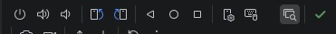
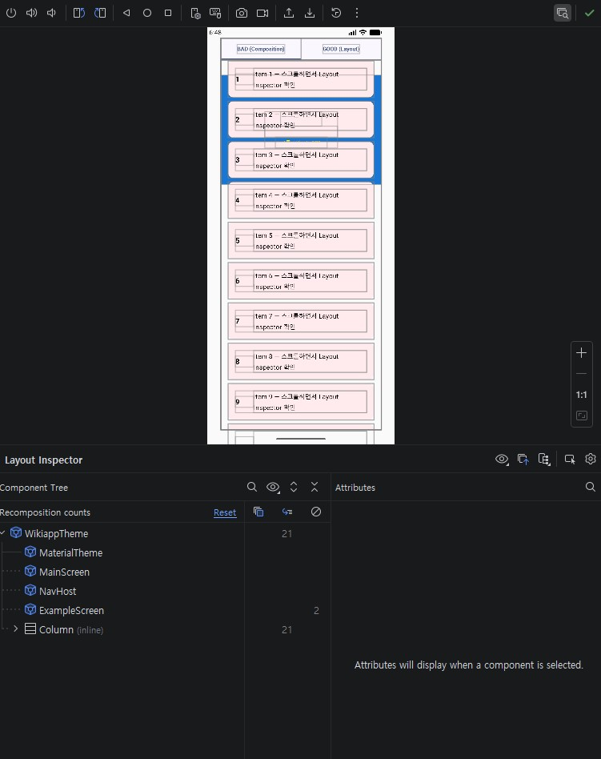
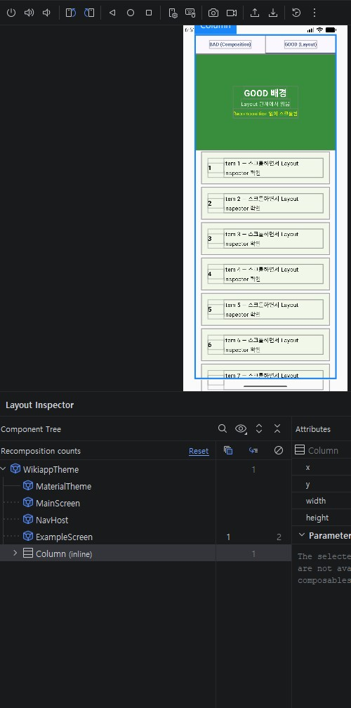

## 개발환경에서 눈으로 확인하기

[1. Android Studio에서 확인하기](#section-1)

* * *
### 1. Android Studio에서 확인하기

초록색 체크표시 바로 왼쪽에 아이콘을 누르면 레이아웃 인스펙터가 열리고 아래와 같은 화면이 보일 것이다.

현재 상태는 컴포지션 단계부터 리컴포지션이 일어나게 했는데 스크롤을 잠깐 했다가 멈추면
리컴포지션 횟수가 많이 늘어나 있을 것이다. 이제 Good탭으로 이동해서 스크롤을 해보자.  

아무리 스크롤을 해도 이미지에 나와 있는 대로 리컴포지션 횟수가 고정되어 있다.