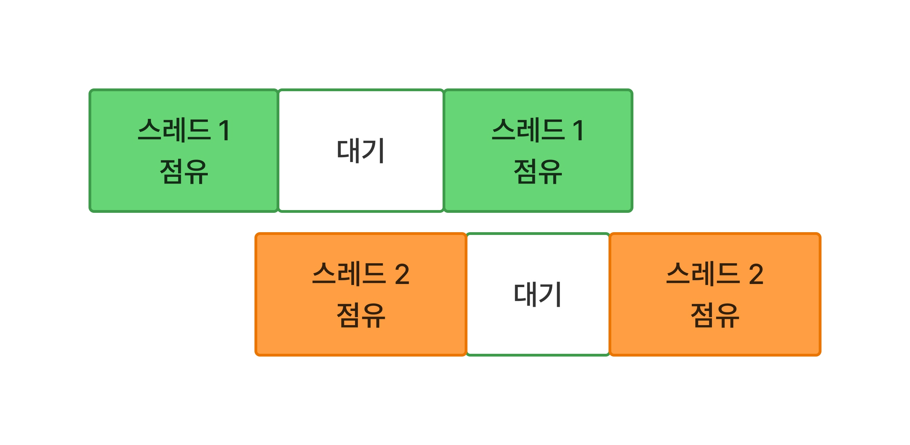

# 코루틴(Coroutine)

[1. 자바 멀티스레드와 코루틴](#section-1)
[2. 코루틴](#section-2)
[3. 코루틴 빌더](#section-3)
[4. 실행환경 변경](#section-4)

* * *
### <span id="section-1">1. 자바 멀티스레드와 코루틴</span>

코루틴은 코틀린에서 스레드를 효율적으로 사용하여 비동기를 실현하는 방법이다.
스레드를 효율적으로 사용한다고 했는데, 이전에는 어땠나 하는 생각이 들 수 있다.

| 자바 스레드         | 코틀린 코루틴       |
|----------------|---------------|
| 스레드를 점유        | 스레드를 반납       |
| 코드가 복잡함        | 동기 코드 처럼 복잡하지 않음 |
| 동시에 수백 개 정도 한계 | 동시에 수만 개 가능   |


여기서 스레드를 반납 한다고 되어 있는데 동시성을 다시 생각해볼 필요가 있다.
동시성은 실제로 동시에 작업이 일어나는 것이 아닌 **여러 작업들이 번갈아 가면서 스레드를 사용하는 것**
이다. 단지 컴퓨터가 워낙 빠르기에 동시에 실행되는 것처럼 보이는 것이다.

여러 작업들이 번갈아 가면서 사용한다고 했다. 그러면 스레드를 점유한다는 의미다.
아래 이미지는 자바 멀티스레드를 나타낸 것이다.



근데 사이사이에 대기가 들어가있다. 왜 대기를 해야 할까?  

스레드는 프로세스가 가진 자원을 공유한다고 했다. 그 중에서 데이터의 경우, 같은 데이터를 동시에
변경하는 일이 생겨나서는 안된다. 그런 경우에는 이미지와 같이 대기가 발생한다. 공유자원의 데이터를
다른 스레드에서도 같은 데이터를 사용하게 하는 것을 동기화라고 한다. 동기화를 하지 않으면
같은 데이터에 접근했는데 서로 다른 값을 조작하고 있을 수 있다.


예시를 하나 들어보자면 만약 입출금이 이루어진다고 했을 때 입금처리를 하는 스레드와 출금처리를 하는
스레드가 있다고 가정하자. 입급하는 스레드와 출금하는 스레드가 데이터들 동시에 조작하면 입금 하는 스레드는
값이 증가한 데이터를 보게 되고, 출금하는 스레드는 값이 감소한 데이터를 보게된다. 우리가 흔히 아는
결과대로라면 증가 후 감소가 되거나 감소 후 증가가 되야 하는 데 말이다. 그래서 스레드에서 대기가
필요하다.

어떻게 보면 각 스레드가 대기하는 시간이 낭비된다고 볼 수 있다. 대기하는 시간에도 스레드를 쉬게
하지 않고 계속 일을 시킬 수 있음에도 대기를 시키는 것이다.

> 일상 생활에서의 예시를 들자면 본인을 어느 음식점의 사장이고 아르바이트는 두 명 있다고 가정하자.
알바 한 명은 서빙만, 나머지 한 명은 테이블 치우기만 하는 데, 중간 중간에 서빙하는 알바의 여유가
생겼을 때 꼭 해야 하는 또 다른 일(재고 정리 같은 것)을 시키고 싶지 않은가? 
컴퓨터 과학은 요약하자면 악독 사장(프로그래머)이 직원(컴퓨터)에게 쉴 새 없이 일을 시키는 것이다.


이러한 자바 멀티 스레드가 대기하는 것을 문제로 두고 코틀린에서는 해결책을 코루틴으로 내놓았다.  


### <span id="section-2">2. 코루틴</span>


코루틴은 한 스레드에 대해 얼마나 효율적으로 사용하는 고민에 대한 해결책이다.
코루틴은 대기 하지 않는다. 대기가 아닌 잠시 멈추고(suspend) 다른 작업을 진행한다.


```kotlin
suspend fun longTermTask(){
    delay(3000)
}
```

코틀린에는 일시중단 함수라는 것이 있다. 여기서 일시중단의 의미는 다음과 같다.

- 일시중단: 잠시 멈추고 스레드를 반납함.

단순히 멈추는 것이 아니다. **스레드를 반납**한다는 것이 중요하다. 이렇게 되면 멀티 스레드 처럼
스레드를 여러개 쓰지 않고도 여러 작업을 동시에 진행할 수 있으며, 매우 가볍게 진행할 수 있다.

```kotlin
suspend fun longTermTask(time: Long, taskName: String) {
    println("$taskName Start Task")
    delay(time.milliseconds)
    println("$taskName End Task")
}

fun main(): Unit = runBlocking {
    longTermTask(2000, "Job 1")
    longTermTask(1000, "Job 2")
}


/* result
Job 1 Start Task
Job 1 End Task
Job 2 Start Task
Job 2 End Task
*/
```

위 코드는 일시중단 함수라는 것만 선언하고 작업을 동시에 실행하지 않았다.

```kotlin
suspend fun longTermTask(time: Long, taskName: String) {
    println("$taskName Start Task")
    delay(time.milliseconds)
    println("$taskName End Task")
}

fun main(): Unit = runBlocking {
    launch {
        longTermTask(2000, "Job 1")
    }
    launch {
        longTermTask(1000, "Job 2")
    }
}

/* result
Job 1 Start Task
Job 2 Start Task
Job 2 End Task
Job 1 End Task
*/
```

위 코드를 실행 해보면 이제 동시에 실행되어서 2초가 걸리는 Job1이 나중에 끝나고 1초가 걸리는
Job2가 먼저 끝난다. 생소한 키워드들이 보인다.

runBlocking이나 launch는 코루틴을 만드는 **빌더 함수**다.
이런식으로 코루틴을 만들어가면 된다. 다른 예시도 보자.


```kotlin
// skip...

fun main(): Unit = runBlocking {
    launch {
        launch {
            longTermTask(1000, "Job 1")
        }
        launch{
            longTermTask(3000, "Job 3")
        }
    }
    launch {
        launch {
            longTermTask(2000, "Job 2")
        }
        launch{
            longTermTask(4000, "Job 4")
        }
    }
}

/* result
Job 1 Start Task
Job 3 Start Task
Job 2 Start Task
Job 4 Start Task
Job 1 End Task
Job 2 End Task
Job 3 End Task
Job 4 End Task
*/
```

이런식으로 중첩해서 코루틴을 생성하는 것도 가능하다.


### <span id="section-3">3. 코루틴 빌더</span>


코루틴 빌더는 앞선 섹션에서 살펴본 runBlocking과 launch가 전부는 아니다.

|                | runBlocking         | launch       | async            | coroutineScope |
|----------------|---------------------|--------------|------------------|----------------|
| 스레드 상태         | Blocking            | Non-Blocking | Non-Blocking     | Non-Blocking   |
| 목적             | 모든 코루틴이 끝날 때까지 기다리기 | 반환 값 없는 코루틴  | 반환 값 있는 코루틴      | 코루틴 범위 지정      |
| 반환 타입          | 코드블록의 결과    | Job          | Deferred<T> | 코드블록의 결과       |


runBlocking은 보통 main함수에서 사용한다. 모든 작업이 끝나는 것을 보고 프로세스가 종료되어야 하기 때문이다.
async의 경우 launch와 비슷하지만 결과 값을 가져올 수 있다. coroutineScope의 경우에는 코루틴을 묶는 거라
생각 하면 된다.

```kotlin
fun main(): Unit = runBlocking {
    coroutineScope {
        launch {
            longTermTask(3000, "Job 3")
        }
        launch {
            longTermTask(1000, "Job 1")
        }
    }
    coroutineScope {
        launch {
            longTermTask(4000, "Job 4")
        }
        launch {
            longTermTask(2000, "Job 2")
        }
    }
}

/* result
Job 3 Start Task
Job 1 Start Task
Job 1 End Task
Job 3 End Task
Job 4 Start Task
Job 2 Start Task
Job 2 End Task
Job 4 End Task
*/
```

이전에 했던 예시는 Job 1, 2, 3, 4가 거의 동시에 실행되고 끝나는 순서는 1, 2, 3, 4였다.
하지만 위 예시는 1과 3이 종료된 후에 2와 4가 실행이 된다. 코루틴의 범위를 지정한다는 의미가 이런 의미다.


### <span id="section-4">4. 실행환경 변경</span>

코루틴의 실행환경을 변경할 수 있다.

프로그래머가 코루틴으로 작업을 진행하는데 두 가지 작업을 진행하려고 한다.

1. 엄청나게 많은 양을 매우 빠르게 계산
2. 데이터 입출력

이 두 작업을 코루틴으로 진행하려는데 코틀린은 스레드에게 역할을 부여하여 그룹화 해놨다.
실제로 그 스레드의 역할이 고정된건 아니지만 코틀린이 임의로 부여한 거라고 생각하면 된다.

```kotlin
fun main(): Unit = runBlocking {
    val mainThreadName = Thread.currentThread().name
    println("[$mainThreadName] 메인 스레드 시작"
            
    launch(Dispatchers.Default) {
        val threadName = Thread.currentThread().name
        println("[$threadName] 무지막지하게 수많은 연산...")
        delay(3000.milliseconds)
        println("[$threadName] 무지막지하게 수많은 연산 끝.")
    }
    launch(Dispatchers.IO) {
        val threadName = Thread.currentThread().name
        println("[$threadName] 무지막지하게 많은 데이터 가져오는 중...")
        delay(3000.milliseconds)
        println("[$threadName] 데이터 다 가져왔음.")
    }
}

/* result
[main] 메인 스레드 시작
[DefaultDispatcher-worker-1] 무지막지하게 수많은 연산...
[DefaultDispatcher-worker-2] 무지막지하게 많은 데이터 가져오는 중...
[DefaultDispatcher-worker-2] 데이터 다 가져왔음.
[DefaultDispatcher-worker-1] 무지막지하게 수많은 연산 끝.
*/
```

여기서 오해할 수 있는 것이 Dispatchers는 스레드가 아니다. 어느 스레드로
보낼지 명시하는 역할을 하는 것이다. 코틀린이 그룹화한 스레드 목록은 다음과 같다.  


| Dispatchers | Main   | Default                | IO             | 
|-------------|--------|------------------------|----------------|
| 역할          | 메인 스레드 | 보통 계산용, CPU 코어 개수만큼 존재 | 네트워크, 파일 입출력 등 |


이러한 것을 withContext로 중간에 실행환경을 변경할 수도 있다.