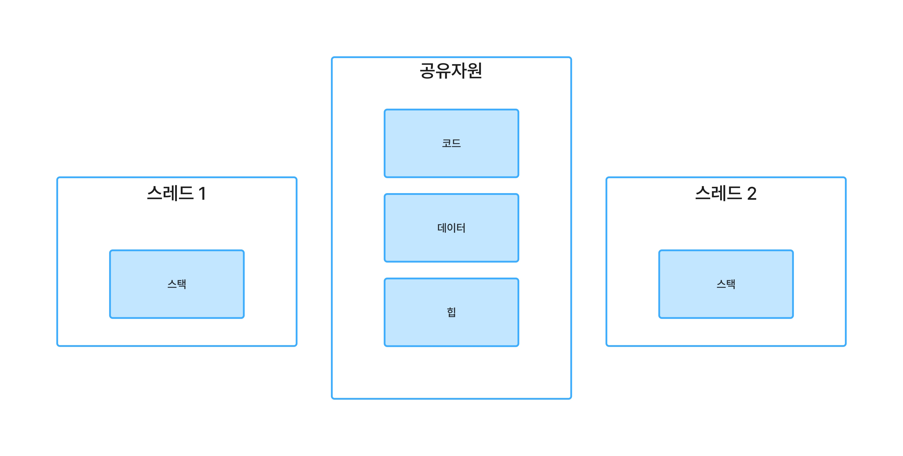

이번 장에서는 비동기에 대해 알아볼 것이다.  

그에 앞서 이해하고 넘어가야 할 부분이 있다.

## 프로세스와 스레드

우리는 일상에서 정말 흔하게 프로그램을 사용 중이다. 그 프로그램은 비휘발성(전원이 꺼져도 지워지지 않는)
기억장치에 저장되어 있다가 우리가 실행을 시키면 휘발성 기억장치(전원이 꺼지면)에 적재된다.

- 프로그램: 작업을 수행하기 위한 명령어들의 집합
- 프로세스: 운영체제(OS)로부터 자원을 할당 받아 실행 중인 프로그램

프로그램과 프로세스의 차이는 단순하다. 실행 중이면 프로세스인거고 아니면 프로그램인 것이다.
여기서 스레드란 프로세스 내에서 실제로 작업을 처리하는 가장 작은 단위이다.

프로세스는 메모리 상에서 별도의 공간을 할당 받는다. 즉, 프로세스는 서로 독립적이다.
반면 스레드는 한 프로세스 내부에서 프로세스가 운영체제로 부터 받은 자원을 스레드끼리 공유하며
사용한다.

## 동시성과 병렬성

- 동시성: 여러 작업이 동시에 진행되는 것처럼 보임.
- 병렬성: 실제로 여러 코어가 작업을 동시에 진행함.

동시성을 활용하는 경우
- 데이터 입출력
- 로깅(실행 기록 정도로 이해하면 된다.)

병렬성을 활용하는 경우
- 대규모 트래픽 처리
- 대규모 연산

이에 대해 스레드와 동기의 차이는 다음과 같다.

- 싱글스레드, 멀티스레드: 한 번에 몇 개 실행할 거냐?
- 동기, 비동기: 작업이 끝날 때까지 기다릴 거냐? 

그래서 위의 각 두 가지 경우를 서로 조합하여 총 4가지 조합이 가능하다.

1. 싱글 스레드 + 동기
2. 싱글 스레드 + 비동기
3. 멀티 스레드 + 동기
4. 멀티 스레드 + 비동기

Jetpack Compose에서도 비동기를 활용할 예정이다.