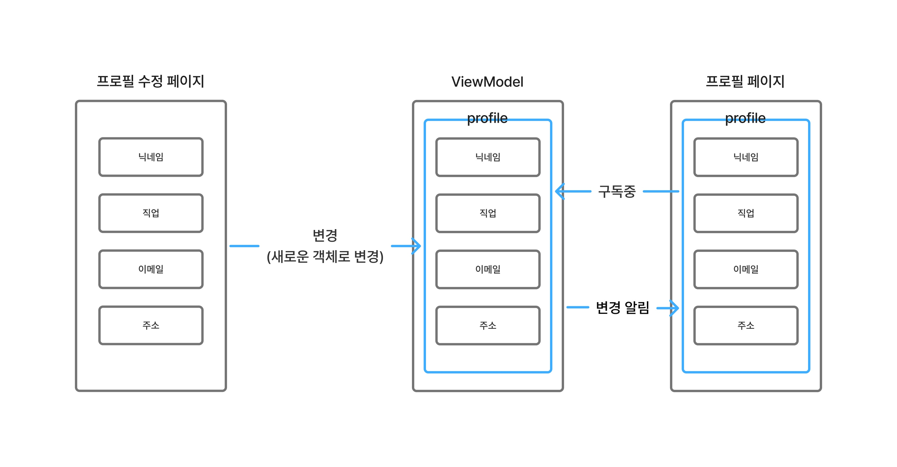

## ViewModel 기초

[1. ViewModel 기초](#1-viewmodel-기초)  
[2. 왜 ViewModel?](#2-왜-viewmodel)

* * *

### 1. ViewModel 기초

7장의 완성된 예제 프로젝트를 열어보자. 이 프로젝트 실습의 시나리오는 간단하다.

1. 앱 실행
2. 홈 페이지, 프로필 페이지
3. 프로필 페이지에서 프로필 수정

이번에 우리가 실습할 환경은 프로필 페이지다. 프로필을 수정할 예정이다.

viewmodel 디렉토리에는 두 개의 클래스 파일이 존재한다.

```kotlin
data class ProfileUiState(
    val name: String = "Your Name",
    val job: String = "Android Developer",
    val email: String = "Your@email.com",
    val location: String = "Your Location",
)
```

```kotlin
class ProfileViewModel : ViewModel() {
    private val _profile = MutableStateFlow(ProfileUiState())
    val profile: StateFlow<ProfileUiState> = _profile.asStateFlow()

    fun updateProfile(name: String, job: String, email: String, location: String) {
        _profile.update {
            it.copy(
                name = name,
                job = job,
                email = email,
                location = location
            )
        }
    }
}
```

```kotlin
@Composable
fun ProfileScreen(
    viewModel: ProfileViewModel = viewModel(),
    onNavigate: (String) -> Unit = {},
) {
    // 변경되면 Recomposition
    // collectAsStateWithLifecycle이 StateFlow를 구독한 상태
    val profile by viewModel.profile.collectAsStateWithLifecycle()

    // ...
}
```

다음과 같은 과정으로 상태가 업데이트될 것이다.



주목해야 할 점은 `ProfileViewModel`의 `_profile`과 `profile`, `_profile.update`,
`ProfileScreen`의 `collectAsStateWithLifecycle`이다.

data class로 상태를 정의하고 상태를 지속적으로 관리하기 위해 `StateFlow` 타입의 변수를 사용한다.
상태를 변경 가능하게 해야 하므로 `MutableStateFlow` 타입으로 `_profile`을 선언한다.

그다음 상태를 외부에서 읽을 수 있도록 공개 변수 하나를 선언한다. 이때는 `StateFlow` 타입의 변수로 선언한다.
상태를 변경하기 위한 공개 함수를 만드는데 이때 `_profile.update`에 주목해야 한다. `update` 내부에서
`it.copy()` 형태로 실행되는데 `copy`는 복사하는 것이다. 복사한다는 말은 새로 만들어낸다는 것이다. 생각해볼 수 있는 것은
상태를 업데이트하는 데 있어서 **값을 직접 수정하는 것**이 아닌 **완전히 새로운 데이터로 변경**한다는 것이다.

`ProfileScreen`에서 Edit Profile 버튼을 누르고 프로필을 수정하고 우측 상단의 Save 버튼을 눌러 저장하면 값이
변경될 것이다.

> 현재 ViewModel과 상태 관리와는 조금 다른 이야기지만 한 가지 짚고 넘어가야 할 부분이 있다면 Save나 Cancel 버튼을 눌렀을 때 새로운 페이지로 이동하는 것이 아닌 그저 이전 페이지로 돌아갈 뿐이다. 만약 새로운 페이지로 넘어가는 것이라면 Recomposition은 일어나지 않는다. 그저 새로운 컴포지션이 만들어질 뿐이다.

### 2. 왜 ViewModel?

기존에 상태를 선언하는 방법은 다음과 같았다.

```kotlin
var name by remember { mutableStateOf(기본값...) }
var job by remember { mutableStateOf(기본값...) }
var email by remember { mutableStateOf(기본값...) }
var location by remember { mutableStateOf(기본값...) }
```

위 방법과 ViewModel은 차이가 뭘까?

바로 수명과 사용하는 목적성의 차이에 있다.

| 구분           | remember             | ViewModel          |
|--------------|----------------------|--------------------|
| 수명           | Composable이 화면에서 사라지면 종료 | Composable이 사라져도 유지 |
| 목적           | 화면 요소 상태             | 비즈니스에서 사용되는 데이터   |
| 보편적인 사용 경우   | 스크롤, 애니메이션 재생 여부     | 사용자 프로필 정보, 서버에서 받아온 상품 목록 |

쉽게 요약하자면

- ViewModel: 서버에서 가져오는 데이터들 담음
- remember: 그 외(웬만하면)

예시 시나리오
1. 로그인을 하고 나서 내 정보가 다른 화면으로 이동한다고 해서 사라지면 안 된다. → ViewModel
2. 화면을 맨 아래까지 스크롤하고 다른 페이지로 이동했다가 다시 이전 화면으로 돌아왔다. 스크롤이 어디까지 되었는지는 중요하지 않다. → remember

> 만약 스크롤이 자주 일어나게 된다면 `rememberSaveable`을 사용하면 된다.